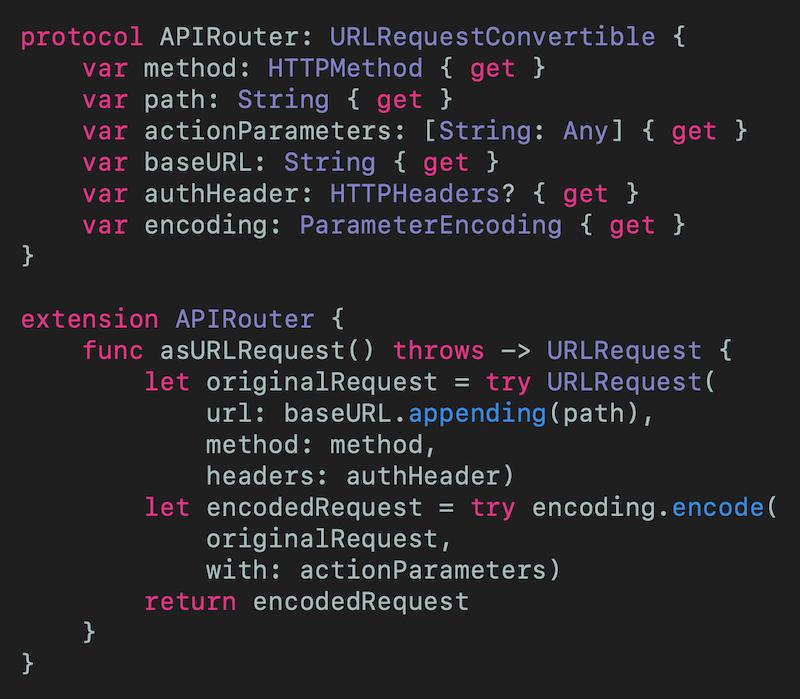
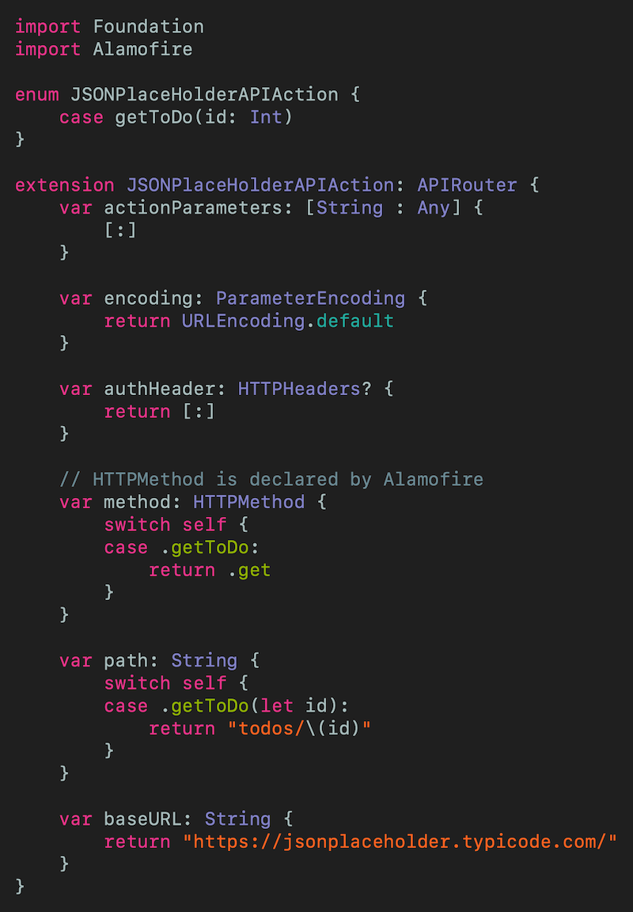
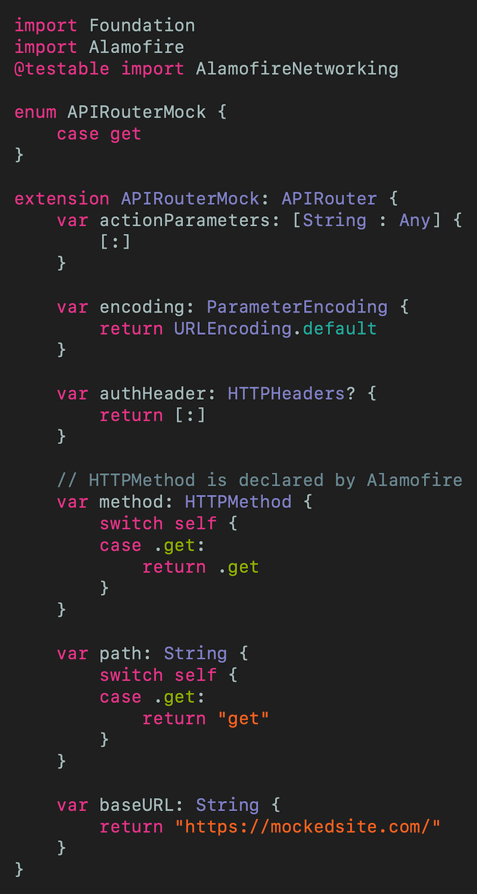
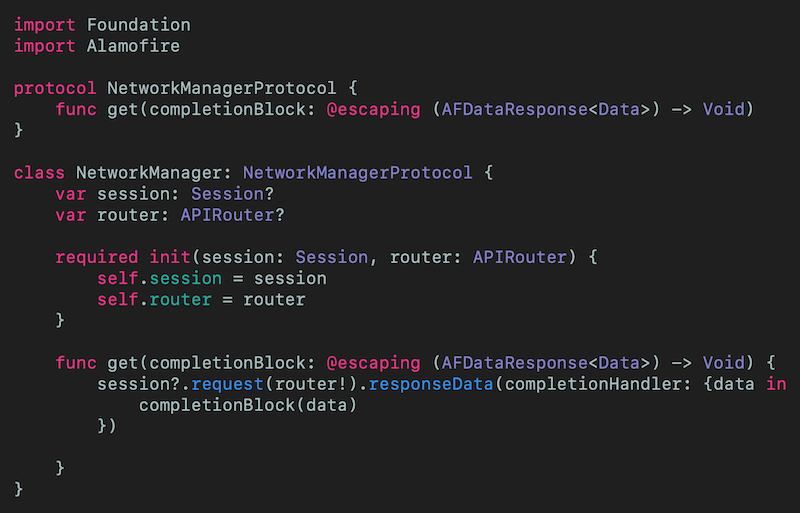
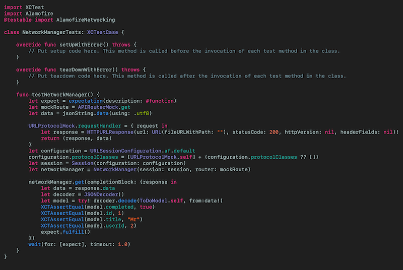
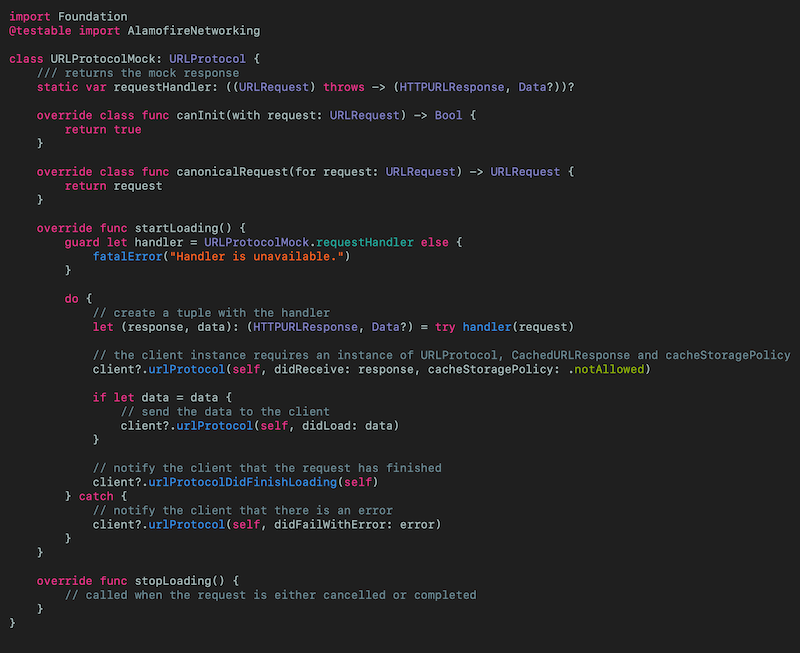
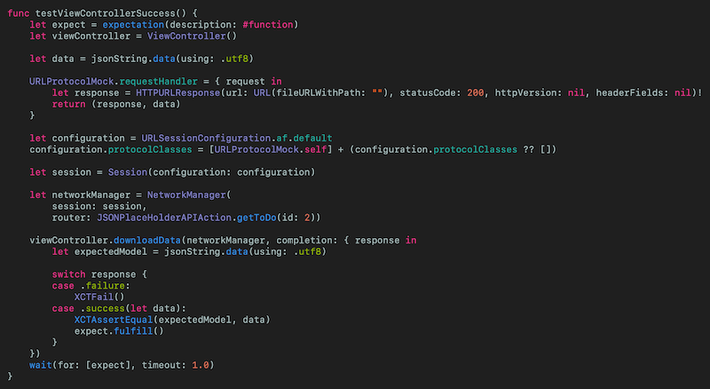
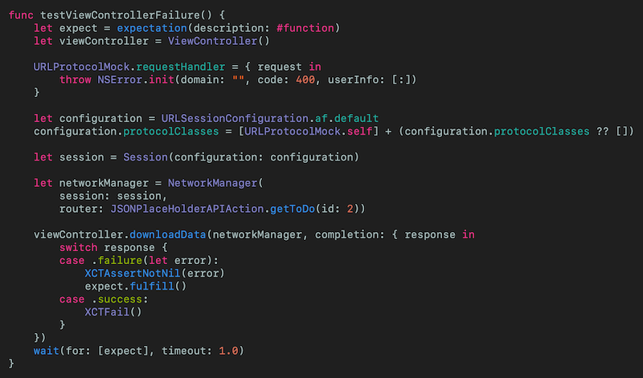

# A Networking Manager with Alamofire
## Can you fully test this?

 
Photo by Jesse Roberts on Unsplash

I've previously written a [network manager](https://medium.com/@stevenpcurtis.sc/my-basic-httpmanager-in-swift-db2be1e340c2) with the intention of testing it completely. Can I do the same using `Alamofire`? That is, test the requisite classes without making *real* network calls?

Read on to find out!

Difficulty: Beginner | Easy | **Normal** | Challenging 
This article has been developed using Xcode 11.4.1, and Swift 5.2.2

## Prerequisites: 
* You will be expected to be aware how to make a [Single View Application](https://medium.com/swlh/your-first-ios-application-using-xcode-9983cf6efb71) in Swift.

# What the project is, and what it isn't
The idea of this project is to create a usable network manager using `Alamofire`, and more than that actually *testing* the manager, in a similar way to the method I used to create a network manager using `urlsession` in a [previous article](https://medium.com/@stevenpcurtis.sc/my-basic-httpmanager-in-swift-db2be1e340c2).

That means that the View Controller accesses the Network Manager directly simply for ease of creating this tutorial (it is not about architecture!). If you want to learn more about the architecture I might use, tyr [this article about MVVM-C](https://medium.com/@stevenpcurtis.sc/mvvm-c-architecture-with-dependency-injection-testing-3b7197eb2e4d) that contains a full example - I usually choose to make the network requests from  the View Model but you might choose to make these from the coordinator.

# The motivation
When I usually create an `Alamofire` project the request seems all very simple. I'd ususally use `Af.request()` and it would look something like the following:

 
[Click for Gist](https://gist.github.com/stevencurtis/e7948b1db62fd7d4ac7a3d58cd3db164)

which seems great. But how can we inject a `urlsession` instance into there? It seems impossible?!? 

So let us get started!

# The approach
## The Alamofire dependency
There are many ways to add Alamofire as a dependency. I've created a full guide to this [HERE](https://medium.com/@stevenpcurtis.sc/use-swift-package-manager-to-add-dependencies-b605f91a4990) but the short version is that I've whacked [https://github.com/Alamofire/Alamofire.git](https://github.com/Alamofire/Alamofire.git) to import a new package up to next major (using [Semantic Versioning](https://medium.com/@stevenpcurtis.sc/upgrade-to-semantic-versioning-31342b11ce97).

## The Alamofire router
Alamofire has a router in order to compile URL Strings and apply headers. The advantage to using this router is  that headers can be put in-place. It sounds fantastic, but I think of this as roughly equivalent to my method of [building URLs in Swift](https://medium.com/swlh/building-urls-in-swift-51f21240c537). 

Like a good Swift progammer I'm going to make this conform to a [protocol](https://medium.com/@stevenpcurtis.sc/protocols-in-swift-f46c31283b18)

so let us see this protocol, which I've called `APIRouter`: note that this file needs to import `Alamofire` as it uses several types included in the third-party framework.

 
[Click for Gist](https://gist.github.com/stevencurtis/588bec50335625eb9bca18e1aea7416b)

We then create a concrete type that conforms to this protocol, I've called this `JSONPlaceHolderAPIAction` because I like catchy names

 
[Click for Gist](https://gist.github.com/stevencurtis/2e94068bd1d8757b123775278b6c869b)

Now for fun, (and since testing is always worth doing) I've developed the following (rather simple) test. Of note here is that I've imported `XCTest` and `Alamofire`, but here is the whole file (it passes!).

 
[Click for Gist](https://gist.github.com/stevencurtis/ed18af01dc0699a21e1e2a1d33b7127b)

Wonderful!

Now for later use I'm going to create a **Mock** version of the router that can be used later on

 
[Click for Gist](https://gist.github.com/stevencurtis/1b3f444e732482e64cfd1e823ecc847c)

## The overall strategy
Usually I'd think about injecting a `Session` instance which could then be replaces during testing using [Dependency injection](https://medium.com/@stevenpcurtis.sc/learning-dependency-injection-using-swift-c94183742187). However, overriding Session just to inject a URLSessionMock isn't really the strategy that the makers of `Alamofire` seemed to have in mind. 

We can do *better* 

# The implementation
## The Network Manager
This is going to work with a `protocol` too (how awesome!) 

 
[Click for Gist](https://gist.github.com/stevencurtis/b9292f371fb4e444f313dd04b50736ac)

### Testing

 
[Click for Gist](https://gist.github.com/stevencurtis/4d66acb204cb0a75b01f6af314424c34)

## The ViewController
Yes, you would never do this in production. Yes, you need to handle the errors that are given from the network operation. Yes, we are accessing the `NetworkManager` straight from the view controller. 

In any case, here is my method of creating a View Controller.

 
[Click for Gist](https://gist.github.com/stevencurtis/36694bb54776956844cf24074b268b6c)

### Testing
Now this, of course needs to be tested. There are two possible tests here - I can use the implementation version of the router or the mocked version of the router. 

In practice the two are the same because we set the result in a `URLProtocolMock` which (in my implementation) does not care about the router. 

How does that look?

Let us take a break for the `URLProtocolMock` instance.

## The URLProtocolMock
 
[Click for Gist](https://gist.github.com/stevencurtis/fd0d8bbae7627204b0a2ffc0d2f5cbd0)

we then have the option (within our tests) of using an instance of `URLProtocolMock` to create 

 
[Click for Gist](https://gist.github.com/stevencurtis/fc39c2ee383b4b70a5cbc11fbd3c5645)

which gives us the session that can then be injected into our `NetworkManager` instance

Awesome.

### Back to testing
We can inject the `URLProtocolMock` using the `ViewController` - no problem - here is the excerpt of the test:

 
[Click for Gist](https://gist.github.com/stevencurtis/f76811cb8719d999e251fbf956d23e52)

This suceeds, so what about a similar test that will fail? As the `requestHandler` is a computed property we can just make it throw!

 
[Click for Gist](https://gist.github.com/stevencurtis/2fa2364ada59cfe1c49e36d2c2c2e1b2)

Fantastico!

# Conclusion
The approach taken is rather different than that for a simple `URLSession`, but it is worth going through this exercise to make sure you NEVER call a real API while testing. 

I mean never.

I hope this article has been of use to you, and that you have enjoyed reading it.

The code from this is included in the attached [Repo](https://github.com/stevencurtis/SwiftCoding/tree/master/AlamofireNetworking). 

If you've any questions, comments or suggestions please hit me up on [Twitter](https://twitter.com/stevenpcurtis) 
