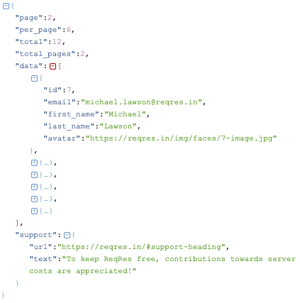

# Decode JSON in Swift: A Full Micro-Project
## A whole project?


<br/>
<sub>Photo by Michael Dziedzic on Unsplash<sub>

# Before we start
Difficulty: Beginner | Easy | **Normal** | Challenging<br/>

## Prerequisites:
* This article skips over [setting up a project](https://medium.com/swlh/your-first-ios-application-using-xcode-9983cf6efb71), and gets rid of the storyboard and uses programmatic constraints as [in this article](https://stevenpcurtis.medium.com/write-programmatic-constraints-for-swift-projects-94cf18b35511)
* Later in the article a real example is used, that is [Decoding JSON](https://medium.com/@stevenpcurtis.sc/decode-json-with-swift-test-e2d26dfafd6d) and the internal workings of this are kind of skipped over
* If you are interested in testing, or a more in-depth explanation of JSON decoding you can look at [this article](https://medium.com/@stevenpcurtis.sc/decode-json-with-swift-and-test-it-e2d26dfafd6d)

## Keywords and Terminology:
JSON: JavaScript Object Notation, a lightweight format for storing and transporting data
Swift: An open source programming language for macOS, iOS, watchOS and tvOS

# The project implementation
## The expected result
This Project is going to take data from an endpoint (the specific endpoint is one of those hosted at [reqres](https://reqres.in)) and displays the result in a `UITextView`.

The end project looks something like the following:

<br/>

So let us press on!


I've used [weak self] (the difference between weak and unowned is explained [here](https://medium.com/@stevenpcurtis.sc/swift-self-weak-or-unowned-7e2327974f36) )

## The detail

**Users Model**
The model is defined by the structure of the data from the endpoint. [https://reqres.in/api/users?page=2](https://reqres.in/api/users?page=2) is
```
{"page":2,"per_page":6,"total":12,"total_pages":2,"data":[{"id":7,"email":"michael.lawson@reqres.in","first_name":"Michael","last_name":"Lawson","avatar":"https://reqres.in/img/faces/7-image.jpg"},{"id":8,"email":"lindsay.ferguson@reqres.in","first_name":"Lindsay","last_name":"Ferguson","avatar":"https://reqres.in/img/faces/8-image.jpg"},{"id":9,"email":"tobias.funke@reqres.in","first_name":"Tobias","last_name":"Funke","avatar":"https://reqres.in/img/faces/9-image.jpg"},{"id":10,"email":"byron.fields@reqres.in","first_name":"Byron","last_name":"Fields","avatar":"https://reqres.in/img/faces/10-image.jpg"},{"id":11,"email":"george.edwards@reqres.in","first_name":"George","last_name":"Edwards","avatar":"https://reqres.in/img/faces/11-image.jpg"},{"id":12,"email":"rachel.howell@reqres.in","first_name":"Rachel","last_name":"Howell","avatar":"https://reqres.in/img/faces/12-image.jpg"}],"support":{"url":"https://reqres.in/#support-heading","text":"To keep ReqRes free, contributions towards server costs are appreciated!"}}
```
can be placed into [http://json.parser.online.fr](http://json.parser.online.fr) which gives us a clear view of the structure of the JSON. In a usual working situation you might well be given a clear API with documentation, but this online parser can still be useful.

<br/>

Now usually we might expect that the properties in our mode `struct` exactly mirror those of the endpoint. However in Swift we usually use [Camel Case](https://medium.com/@stevenpcurtis.sc/the-naming-conventions-you-must-to-know-2783d44b4a5e) rather than snake case, and this is something will we cover when we decode the data - but in this case we can manually translate the Camel Case to Snake Case (for example per_page to perPage).

In order to decode the JSON using `JSONDecoder()` the model must conform to [Codable](https://medium.com/@stevenpcurtis.sc/codable-in-swift-and-ios-12a1415b9aa6), and this applies to the `struct` of the model (called User here) and any nested `struct`.

Although in the video I decided NOT to use nested `struct` instances for `Users`, `UserData` and `Support` since the nested `struct` instances are not referenced from outside the `Struct` I feel that we are actually better to nest them.


```swift
struct Users: Codable {
    let page: Int
    let perPage: Int
    let total: Int
    let totalPages: Int
    let data: [UserData]
    let support: Support

    struct UserData: Codable {
        let id: Int
        let email: String
        let firstName: String
        let lastName: String
        let avatar: String
    }

    struct Support: Codable {
        let url: String
        let text: String
    }
}
```

**ViewController**
The view controller will instantiate the `ViewModel` through it's own initializer, requiring us to create the property and [initializer](https://medium.com/@stevenpcurtis.sc/swift-initializers-fc12908a9106)

```swift
private let viewModel: ViewModel

init(viewModel: ViewModel) {
    self.viewModel = viewModel
    super.init(nibName: nil, bundle: nil)
}

required init?(coder: NSCoder) {
    fatalError("init(coder:) has not been implemented")
}
```

Most of the rest of the details in the class are about creating (the poorly named - sorry) `UITextView`, where the action takes place mostly in `viewDidLoad`.

```swift
private lazy var text: UITextView = .init(frame: .zero)

override func viewDidLoad() {
    super.viewDidLoad()
    setupHierarchy()
    setupComponents()
    setupConstraints()
}

func setupHierarchy() {
    view.addSubview(text)
    text.translatesAutoresizingMaskIntoConstraints = false
}

func setupComponents() {
    text.textAlignment = .center
    text.isUserInteractionEnabled = false
    text.text = "Placeholder"
}

func setupConstraints() {
    NSLayoutConstraint.activate([
        text.topAnchor.constraint(equalTo: view.topAnchor),
        text.bottomAnchor.constraint(equalTo: view.bottomAnchor),
        text.leadingAnchor.constraint(equalTo: view.leadingAnchor),
        text.trailingAnchor.constraint(equalTo: view.trailingAnchor)
    ])
}
```

However the real action goes on in `viewDidAppear` - now I know this loading will happen in front of the user (after all, the view will have appeared to the user before we even make the network call)

```swift
override func viewDidAppear(_ animated: Bool) {
    super.viewDidAppear(animated)
    viewModel.completion = {
        let text = $0.data.map{ "\($0.firstName) \($0.lastName): \($0.email)" }.joined(separator: "\n")
        DispatchQueue.main.async {
            self.text.text = text

        }
    }
    viewModel.downloadFiles()
}
```

now we assign the completion hanlder in the view model (more to come of this later), which will return a `Users` object. Now instead of explicitly defining a name for the object $0 is used as a shorthand for the first argument (and represents a the `Users` array), and the second shorthand argument $0 represents each User in turn.

<br/>


## The full classes
Now there is the full code in the [repo](https://medium.com/@stevenpcurtis.sc/downloading-repos-from-github-13a017951450) at [https://github.com/stevencurtis/SwiftCoding/tree/master/DecodeReqres](https://github.com/stevencurtis/SwiftCoding/tree/master/DecodeReqres), but here is the code reproduced:

**SceneDelegate**
```swift
class SceneDelegate: UIResponder, UIWindowSceneDelegate {

    var window: UIWindow?

    func scene(_ scene: UIScene, willConnectTo session: UISceneSession, options connectionOptions: UIScene.ConnectionOptions) {
        guard let windowScene = (scene as? UIWindowScene) else { return }
        window = UIWindow(frame: windowScene.coordinateSpace.bounds)
        window?.windowScene = windowScene

        self.window = UIWindow(windowScene: windowScene)

        let viewModel = ViewModel()
        let viewController = ViewController(viewModel: viewModel)

        let nav = UINavigationController(rootViewController: viewController)

        self.window?.rootViewController = nav
        self.window?.makeKeyAndVisible()
    }

    func sceneDidDisconnect(_ scene: UIScene) {
    }

    func sceneDidBecomeActive(_ scene: UIScene) {
    }

    func sceneWillResignActive(_ scene: UIScene) {
    }

    func sceneWillEnterForeground(_ scene: UIScene) {
    }

    func sceneDidEnterBackground(_ scene: UIScene) {
    }
}
```
**ViewController**
```swift
class ViewController: UIViewController {

    private let viewModel: ViewModel

    private lazy var text: UITextView = .init(frame: .zero)

    override func viewDidLoad() {
        super.viewDidLoad()
        setupHierarchy()
        setupComponents()
        setupConstraints()
    }

    func setupHierarchy() {
        view.addSubview(text)
        text.translatesAutoresizingMaskIntoConstraints = false
    }

    func setupComponents() {
        text.textAlignment = .center
        text.isUserInteractionEnabled = false
        text.text = "Placeholder"
    }

    override func viewDidAppear(_ animated: Bool) {
        super.viewDidAppear(animated)
        viewModel.completion = {
            let text = $0.data.map{ "\($0.firstName) \($0.lastName): \($0.email)" }.joined(separator: "\n")
            DispatchQueue.main.async {
                self.text.text = text

            }
        }
        viewModel.downloadFiles()
    }

    func setupConstraints() {
        NSLayoutConstraint.activate([
            text.topAnchor.constraint(equalTo: view.topAnchor),
            text.bottomAnchor.constraint(equalTo: view.bottomAnchor),
            text.leadingAnchor.constraint(equalTo: view.leadingAnchor),
            text.trailingAnchor.constraint(equalTo: view.trailingAnchor)
        ])
    }

    override func loadView() {
        let view = UIView()
        view.backgroundColor = .red
        self.view = view
    }

    init(viewModel: ViewModel) {
        self.viewModel = viewModel
        super.init(nibName: nil, bundle: nil)
    }

    required init?(coder: NSCoder) {
        fatalError("init(coder:) has not been implemented")
    }

}
```

**ViewModel**
```swift
class ViewModel {
    var completion: ((Users) -> Void)?

    func downloadFiles() {
        guard let url = URL(string: "https://reqres.in/api/users?page=2") else {return}
        let task = URLSession.shared.dataTask(with: url, completionHandler: { [weak self] data, response, _ in
            guard let data = data,
                  let httpResponse = response as? HTTPURLResponse,
                  200..<300 ~= httpResponse.statusCode
            else {return}
            let decoder = JSONDecoder()
            decoder.keyDecodingStrategy = .convertFromSnakeCase
            if let decoded = try? decoder.decode(Users.self, from: data) {
                self?.completion?(decoded)
            }
        })
        task.resume()
    }
}
```

**Users**
```swift
struct Users: Codable {
    let page: Int
    let perPage: Int
    let total: Int
    let totalPages: Int
    let data: [UserData]
    let support: Support

    struct UserData: Codable {
        let id: Int
        let email: String
        let firstName: String
        let lastName: String
        let avatar: String
    }

    struct Support: Codable {
        let url: String
        let text: String
    }
}
```

# Conclusion
Some people claim that mobile development is nothing but taking JSON strings and displaying them on screen. In that case, this article certainly has you covered.

In any case, this is a good start in processing the data that you would need to be able to do in order to create a worthwhile project in Swift.

I hope this is of help to you.

If you've any questions, comments or suggestions please hit me up on [Twitter](https://twitter.com/stevenpcurtis)
