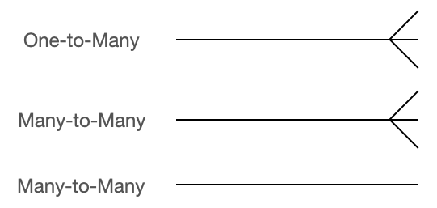
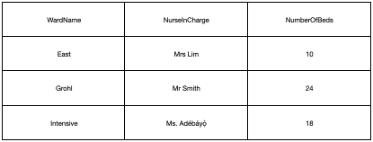
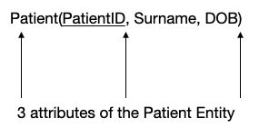
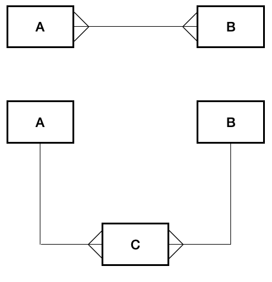

# ERD Diagram
## Create Database Links

A class diagram is a way of representing the structure of a system by showing classes, attributes, operations and relationships among objects.

An Entity Relationship Diagram (ERD) shows the relationships of entity sets stored in a database.

# Before we start
Difficulty: Beginner | Easy | **Normal** | Challenging 

# Terminology:
ERD: An Entity Relationship Diagram (ERD) shows the relationships of entity sets stored in a database

# Prerequisites:
- You will be expected to be aware how to make a [Single View Application](https://medium.com/swlh/your-first-ios-application-using-xcode-9983cf6efb71)

# Entities and Entity-Relationship Diagrams
An entity represents an activity, concept, event, object, person, place or thing of interest to an organization and about which the data represents.

The diagram represents a relationship between *two* of the entities 

 

Note that Entity names are singular, and the relationship is represented by the association between the two entities. In the case of the ward and patient, note that there is a *one-to-many* relationship between the two. 

 

We can express the relationship between the entities as the degree between the two.

This degree can be represented as one of the following:

 

Now a particular entity, in this example a Ward, has a number of *attributes*.

 

The *WardName* is the identifier for the entity Ward, and is underlined to make this clear in the diagram. An entity identifier can either be a singular attribute of a combination of attributes that have sufficient data to uniquely identify an instance or an occurrence of the entity.

 

Each row in the table represents an occurrence of the entity Ward.

Now it makes sense that there are a number of Patient Entities on the Ward.

The connection between the entities is through a connection line. We can represent this as a connection line

 

The PatientID is the identifier for the entity Patient.

Here is how the Patient is represented (the PatientID)

 

# The Rules
When a One-to-Many relationship exists between two entities, the equivalent relations are created by incorporating a copy of the entity identifier on the one-side entity to the entity on the many side.

Before turning entities into relations any many-to-many relationship must be replaced by two one-to-many relations.

 

Here an extra entity has been included, `C` which at the minimum will include entity identifiers from entities `A` and `B`.

# Relational Databases
When a system analyst captures data requirements for a new system, these requirements are typically recorded in a 
* Data dictionary
* A set of entity descriptions
* A set of entity-relationship diagrams

A relational database is a collection of tables, and models relationships (for example a one-to-many relationship) using shared or common attributes.

In the above example, a Patient must be modified to be turned into a relation since there needs to be a relationship between the two tables.

 

Essentially what has happened here is we have imported a Foreign Key into the Patient Entity. A foreign key is "foreign" to the entity, because it is the primary key in another entity. 

We can also recognise that the WardName is a Common attribute, in this case it is common between a Ward and a Patient.

# Conclusion

Do I use ERD diagrams at work? No, I confess I don't.
But I can.

Having basic CS101 knowledge will help you at work. You probably will come across ERD diagrams during your work, so why not prepare now?

I hope this guide helps you to do just that. Thanks for reading!

Subscribing to Medium using [this link](https://medium.com/r/?url=https%3A%2F%2Fstevenpcurtis.medium.com%2Fmembership) shares some revenue with me.

You might even like to give me a hand by buying me a coffee https://www.buymeacoffee.com/stevenpcuri.

If you've any questions, comments or suggestions please hit me up on [Twitter](https://twitter.com/stevenpcurtis)
