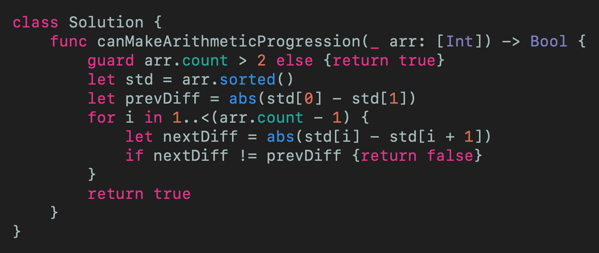
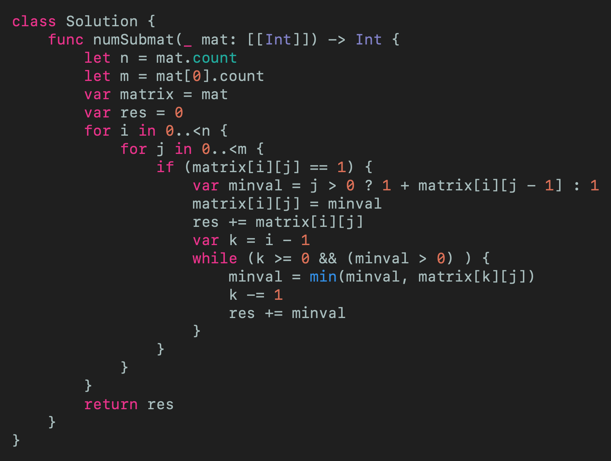
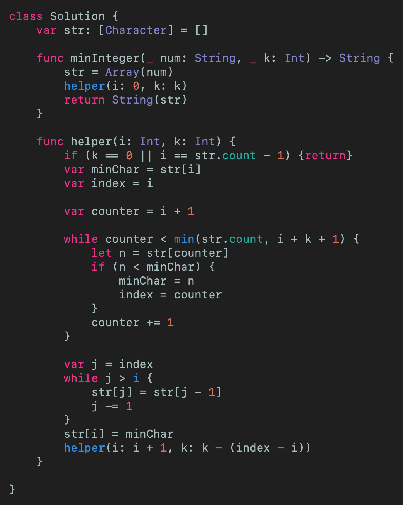

# LeetCode Weekly Contest 196 Swift Solutions
## That weekly contest!

 
Photo by Art Lasovsky on Unsplash

This article is about the 4 challenges in the LeetCode Weekly Contest 195. That is
* 1502 Can Make Arithmetic Progression From Sequence
* 1503 Last Moment Before All Ants Fall Out of a Plank
* 1504 Count Submatrices With All Ones
* 1505 Minimum Prossible Integer After at most K Adjacent Swaps On Digits

[https://github.com/stevencurtis/SwiftCoding/tree/master/LeetCode/Contests/195](https://github.com/stevencurtis/SwiftCoding/tree/master/LeetCode/Contests/195)

The solutions assume some knowledge of [Big O notation](https://medium.com/@stevenpcurtis.sc/beginners-big-o-for-swift-developers-c1ca94f2520)

# The Problems
Each problem will be approached in turn, with a solution and also with articles explaining the tools, techniques and theory that will help you solve these problems yourself.

Let us get started!

## 1502 Can Make Arithmetic Progression From Sequence
Given an array of numbers `arr` return `true` if the array can be rearranged to form an arithmetic progression, otherwise return `false`. An arithmetic progression is if all of the differences between consecutive numbers are the same. Reordering the `arr` is allowed as we are talking about any possible subsequence.

Therefore if there are 0, 1 or 2 integers in the array, `true` should be returned.

Since we can resort the array, I chose to use Swift's `sort()` to sort the array in an efficient way. 

Then we walk through the array, and if any two element do not have the same difference as the difference between the first two elements, we return `false`.

 
[Click for Gist](https://gist.github.com/stevencurtis/f3214f1c281f4bd4c6e5ae290deb6182)

## 1503 Last Moment Before All Ants Fall Out of a Plank
A zero-indexed array represents a plank of `n` units.  Return the largest from n - right.min() and left.max().

The reason for the rather brief explaination of this is because this is a brain-teaser problem, and when broken down it gives us the following solution.  

 
[Click for Gist](https://gist.github.com/stevencurtis/853ff22a73ab8503a395471cc746bf72)

## 1504 Count Submatrices With All Ones
Given a matix of `rows` * `columns` return how many submatrices have all ones. This is effectively a flood-fill. 

The algorithm to work this is out reasonably easy - each square will add 1 to the number - in addition to all of the `singles` we add the existing values to the **left** and **top** of the element you are working on.

This kind of uses the matrix as a cache for the previous values, but we only take the value to the left of the current cell but take all of the contigious elements above the current cell - but only cumulatively add the values horizontally and not vertially. 

This is one of those ones that are slightly easier to see in code:

 
[Click for Gist](https://gist.github.com/stevencurtis/10797b0286c207451ec085364116d9fe)

## 1505 Minimum Prossible Integer After at most K Adjacent Swaps On Digits
Pending a full solution. The algorithm to get the minumum number with k iterations of the buttle sort algorithm - this one times out.

 
[Click for Gist](https://gist.github.com/stevencurtis/ee72ff0b7738a0b8a8ad5c4d44e80163)

# Conclusion
If you've any questions, comments or suggestions please hit me up on [Twitter](https://twitter.com/stevenpcurtis) 

Feel free to sign up to my [newsletter](https://slidetosubscribe.com/embed/swiftcoding/)
