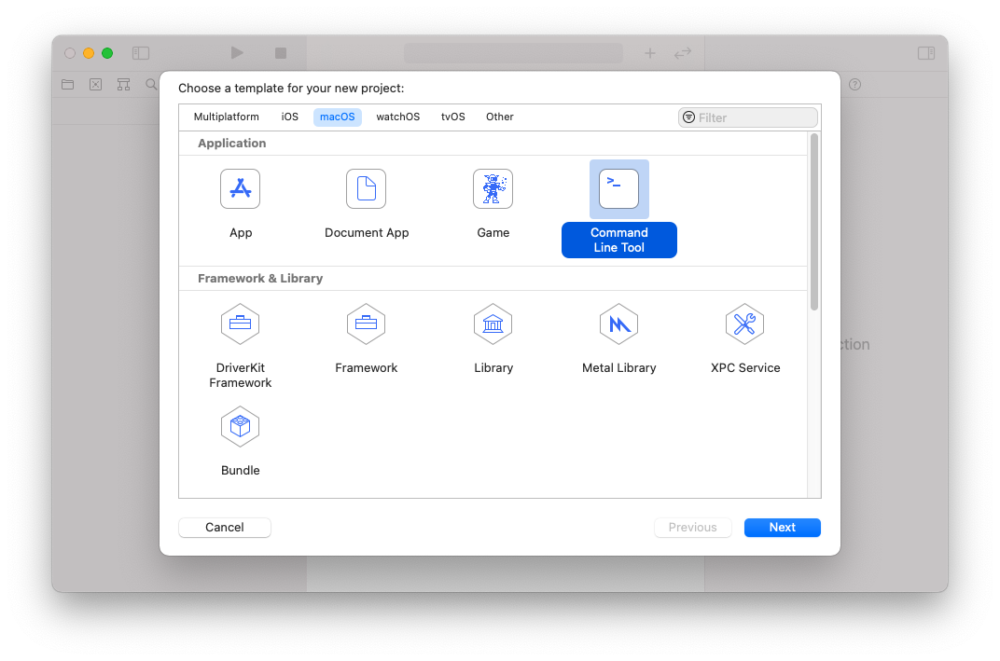
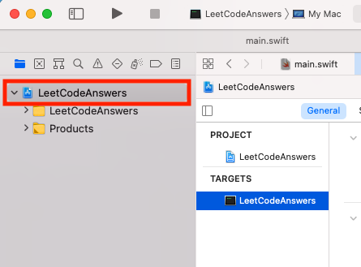
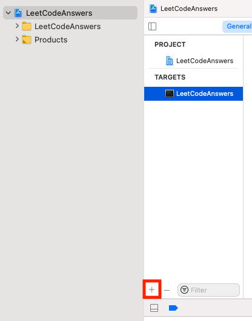
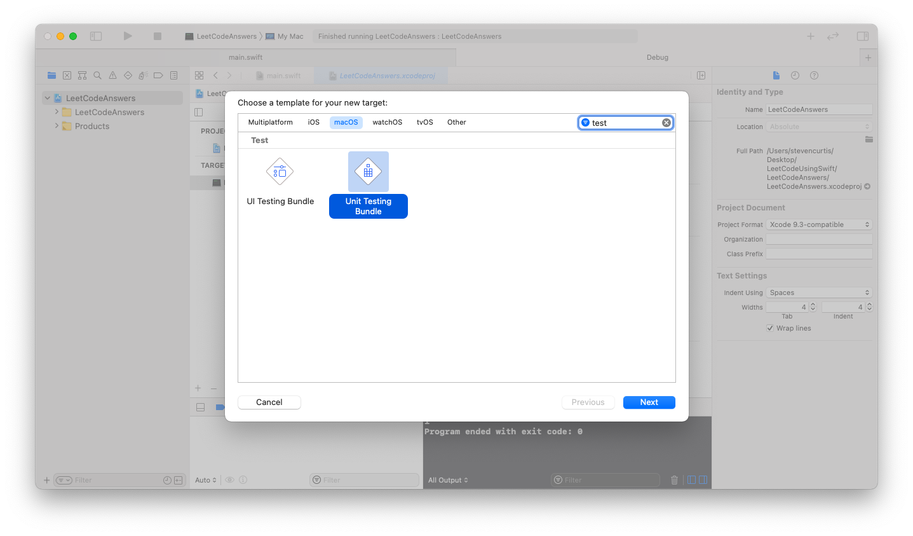
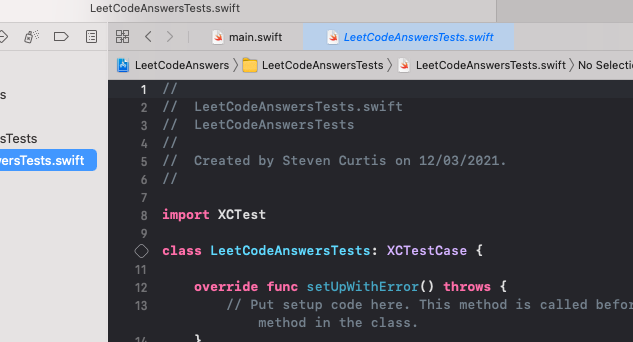
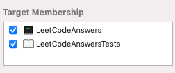

# Avoid Playgrounds, for Swift LeetCode challenges
## Use the macOS Command Line Tool template

Taking an example project from LeetCode, I might try to find the answer for `1413. Minimum Value to Get Positive Step by Step Sum`.

Now I told a lie, in one of these articles. Specifically [in my Playgrounds article](https://stevenpcurtis.medium.com/swift-playgrounds-are-great-for-leetcode-challenges-763a94ea429e) I said I don't use Playgrounds for LeetCode challenges because of the setup. I actually don't use Playgrounds because sometimes they are slooow, or don't seem to work for me when I first start a new Playground. I don't know why, perhaps it's because I'm using a 2016 MBP? In any case, I really use the macOS Command Line Tool, and set this up with testing.

This article is about how *you* might do the same.

The supporting video is @

## The problem

Initially the problem is quite confusing.

The description is, to be honest, not that great. So here is my interpretation:

Given an array of Interges called `num` traverse the array from left-to right keeping a running total. Find an initial number such that the running totol is never less than 1. 

The original description is @ [https://leetcode.com/problems/minimum-value-to-get-positive-step-by-step-sum/](https://leetcode.com/problems/minimum-value-to-get-positive-step-by-step-sum/).

## Create the initial project
In order to use breakpoints, I'm going to use the macOS Command Line Tool.

<br/>

Starting the initial project, we can use the examples given in the project to start us off:

```swift
class Solution {
    func minStartValue(_ nums: [Int]) -> Int {
        return 0
    }
}

let sol = Solution()

//print(sol.minStartValue([-3, 2, -3, 4, 2])) // 5
//print(sol.minStartValue([1, 2])) // 1
//print(sol.minStartValue([1, -2, -3])) // 5
```
where we can uncomment each of the possible executions of the algorithm at the bottom, in turn. We can then develop a solution, and if any of the test cases fail we can add them on the bottom with another `print` statement at the bottom.

## Create a test target
By selecting the blue project at the top-left hand corner of the screen allows us to see the project targets. 

<br/>

You can then click the + icon to add a new target, which is going to be our test target!

<br/>

We then add a Unit Test Bundke, here I've made that easier by searching for test. 

<br/>

I then call the test product `LeetCodeAnswersTests`.

<br/>

Right away we can run the tests, by selecting the file within the `LeetCodeAnswersTests` target and then selecting one of the attractive-looking diamonds. Xcode asks me if I want to switch to my test target, which of course I do!

The tests then all pass, but we need to add our actual tests in!

In order for our test target to be able to access the classes in main, we switch to `main.swift` and then check the Target Membership so (in this particular case) the sile is a member of both `LeetCodeAnswers` and `LeetCodeAnswersTests`

<br/>

We can then set up the test class:

```swift
class LeetCodeAnswersTests: XCTestCase {
    var solution: Solution?

    override func setUpWithError() throws {
        solution = Solution()
    }

    func testOne() {
        XCTAssertEqual(solution?.minStartValue([-3, 2, -3, 4, 2]), 5)
    }

    func testTwo() {
        XCTAssertEqual(solution?.minStartValue([1, 2]), 1)
    }
    
    func testThree() {
        XCTAssertEqual(solution?.minStartValue([1, -2, -3]), 5)
    }
}
```

Of course, initially all of these will fail. 

We need to code the *solution* in order to see these pass! So in the `main.swift` class we can use the following:

```swift
class Solution {
    func minStartValue(_ nums: [Int]) -> Int {
        var start = 0
        var minVal = 0
        for value in nums {
            start += value
            minVal = min(start, minVal)
        }
        return abs(minVal) + 1
    }
}
```
we now re-run the tests and, thankfully, they all pass! Wonderful!

# Conclusion
I hope this article has really helped you out!

This is the technique that I use for solving LeetCode problems, and perhaps this will help you to complete those challenges when preparing for interviews (or just doing them for fun!) too.

If you've any questions, comments or suggestions please hit me up on [Twitter](https://twitter.com/stevenpcurtis)
