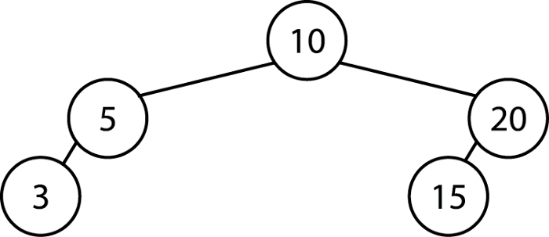

# Swift: Using Depth-First Search for LeetCode Problems
## Algorithms in Swift


<sub>The DFS for this tree is 3, 5, 10, 15, 20 </sub>

# Before we start
Depth-first search for trees is commonly used for LeetCode challenges, even those rated as Medium or above on the platform.

## Prerequisites
To follow along with this piece, you should be able to create a binary tree using insertions (although a simple implementation is shown below).<br>
It would be helpful to be familiar with the concept of [recursion](https://stevenpcurtis.medium.com/recursion-a-swift-story-about-recursion-f54fc84dd4ae),<br> and the solution makes use of Swift's [inout parameters](https://medium.com/@stevenpcurtis.sc/inside-swifts-inout-parameters-f66fc39f3e8c)<br>

## Keywords and Terminology
Root node: The first node in a tree data structure
Tree: A data structure with a root value and left and right subtrees

# Using DFS for the sample tree


This is a recursive process going on here. This particular implementation of DFS will follow the algorithm, after starting at the root node (this represents an **inorder** traversal):
* explore left subtree
* traverse (print out) the node
* explore right subtree

Each exploration as described in that algorithm is itself an example of the **inorder** traversal.

A sample implementation is featured here, and is ready to go in a Playground (you can download an alternative version from the [Repo](https://github.com/stevencurtis/SwiftCoding/tree/master/Theory/SwiftUsingDFSforLeetCodeProblems).

```swift
import UIKit
import XCTest

class Node: CustomStringConvertible {
    var description: String { return "\(self.data)" }
    var data: Int
    var left: Node?
    var right: Node?
    
    init(_ data: Int) {
        self.data = data
    }
    
    func insert(_ data: Int) {
        if (data < self.data){
            if let lft = self.left {
                lft.insert(data)
            } else {
                let newNode = Node(data)
                left = newNode
            }
        } else {
            if let rht = self.right {
                rht.insert(data)
            } else {
                let newNode = Node(data)
                right = newNode
            }
        }
    }
}

func dfsRecursiveVals(_ node: Node) -> [Int]{
    var visitedNodes = [Int]()
    if let lft = node.left {
        visitedNodes += dfsRecursiveVals(lft)
    }
    visitedNodes.append(node.data)
    if let rgt = node.right {
        visitedNodes += dfsRecursiveVals(rgt)
    }
    return visitedNodes
}

class dfsTests: XCTestCase {
    var bt = Node(10)
    override func setUp() {
        bt.insert(5)
        bt.insert(20)
        bt.insert(3)
        bt.insert(15)
    }
  
      func testdfsReturnVals() {
            XCTAssertEqual(dfsRecursiveVals(bt), [3,5,10,15,20])
            XCTAssertEqual(dfsRecursiveVals(regularTree), [4, 8, 10, 12, 14, 20, 22])
    }
}

dfsTests.defaultTestSuite.run()
```

# LeetCode
## LeetCode has a new problem this week:
**1625. Lexicographically Smallest String After Applying Operations**

Now Lexicographically means the alphabetical order, for example if we have an array `["ap", "apply", "apple"]` a sorted array should produce `["apple", "apply", "ap"]`.

The question allows us to apply two operations any number of ties to define the order of a `String` `s`:
* Add a Integer `a` to the odd indicies of s (with 0 being even)
* Rotate the string `s` by `b` positions.

The challenge is to return the **lexicographically smallest** `String`.

**The strategy**

**Implementing the operations**
We can rotate the elements in an Array using the [range](https://stevenpcurtis.medium.com/using-swifts-ranges-1da59e7d9fbe) inbuilt within Swift. 
```swift
func rotate(_ s: [Character], _ b: Int) -> String {
    var cs = s
    cs.append(contentsOf: cs[0..<b])
    cs.removeFirst(b)
    return String(cs)
}
```

add (this is to add an Integer `a` to the odd indicies of s. This can be done using the following. I've chosen to use the [map](https://medium.com/@stevenpcurtis.sc/mapping-in-swift-a6d6132a38af) function but of course there are alternatives that you might choose to use!

```swift
func add(_ s: [Character], _ a: Int) -> String {
    var cs = s
    cs = cs.enumerated().map({
        if $0.offset % 2 == 1 {
            return Character(String( (Int(String($0.element))! + a) % 10 ))
        }
        return $0.element
    })
    return String(cs)
}
```

The [recursive](https://stevenpcurtis.medium.com/recursion-a-swift-story-about-recursion-f54fc84dd4ae) step is the most tricky. Here we are using the DFS algorithm to return the smallest ultimate result from applying `add` or `rotate` on any particular `Character` in the `String`. 

Essentially this is performed as a modified DFS algorithm where we are performing the operations on each Character of the `String` and calculating which returns the smallest `String`. In this case the Lexicographically smallest is calculated simply as the value of the `String` in question.

```swift
func dfs(_ s: String, _ a: Int, _ b: Int, _ visited: inout Set<String>, _ res: inout String) {
    if visited.contains(s) {
        return
    }
    
    visited.insert(s)
    res = min(res, s)
    
    let cs: [Character] = Array(s)
    dfs(rotate(cs, b), a, b, &visited, &res)
    dfs(add(cs, a), a, b, &visited, &res)
}
```

# Conclusion
DFS comes up regularly on LeetCode problems, and it is a good idea to become familar with applying your knowledge to different problems over time. 
I hope you have enjoyed reading this tutorial. The [Repo](https://github.com/stevencurtis/SwiftCoding/tree/master/Theory/SwiftUsingDFSforLeetCodeProblems) has the full solution to the LeetCode problem, as well as the general DFS algorithm as defined above.

If you've any questions, comments or suggestions please hit me up on [Twitter](https://twitter.com/stevenpcurtis) 
