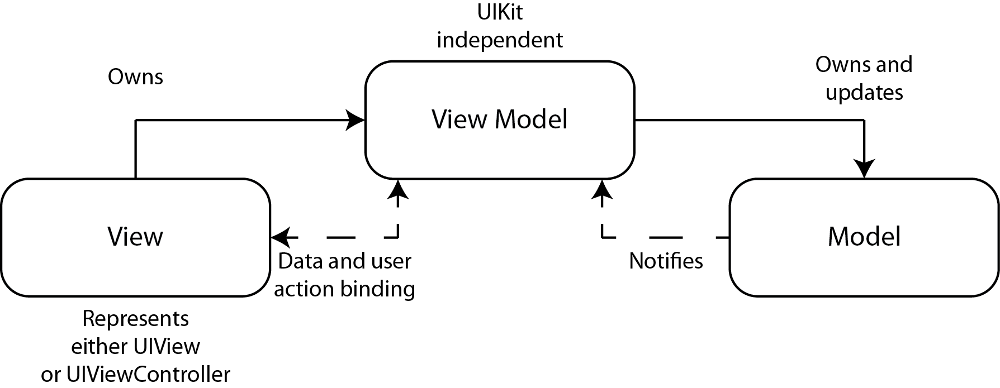
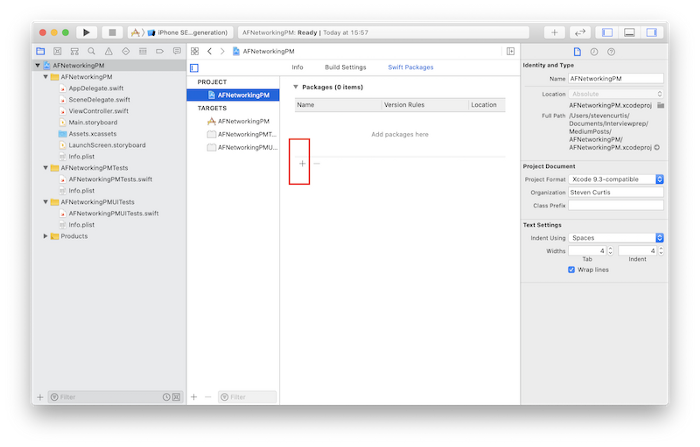

# MVVM Dependency Injection using Storyboards  
## Inject those dependencies!

<br/>
<sub>Photo by 
Nong Vang on Unsplash<sub>

# Terminology:
Dependency Injection: A technique that allows objects to receive other objects on which it depends
MVVM: An architecture pattern consisiting of Model, View and View-Model
Storyboard: A visual representation of the User Interface of an Application

# Useful prerequisites
- [Initializers](https://medium.com/@stevenpcurtis.sc/swift-initializers-fc12908a9106)
- [Segue](https://medium.com/@stevenpcurtis.sc/safe-segues-in-swift-6b38e08bdb9c)

# The example
Sorry, this is awful. I've created two simple screens, neither of which display anything for the user other than a button to go onto the next screen. The first screen makes a network call but prints out the result to the console. 

Simple stuff, right?

# MVVM
I'm going to implement MVVM as follows: <br> 
<br>

this means that we have three seperate sections - the View, View Model and Model.

This means that in this particular case I don't have a model. Why? Because the data I'm pulling in from the network manager will be decoded without a model - not a problem as I'll be showing how the View and ViewModel interact in this example.

## Testing
In order to show how this architecture might be tested, in the test target (so adding a new swift file in your project tests) I've added the following `MockViewModel`:

```swift
import Foundation
@testable import MVVMDI
class MockViewModel: ViewModel {
    var dataRequestClosure: (()->())?
    override func getData() {
        dataRequestClosure!()
    }
}
```

This means that when `getData()` is called in the mock the closure is called, which can be tested for. Excuse the force-unwrapping as this isn't [something that I'd usually do](https://medium.com/@stevenpcurtis.sc/avoiding-force-unwrapping-in-swift-6dae252e970e) but in a test target, well, I do it.

This is then tested with the following tests:

```swift
import XCTest
@testable import MVVMDI
import NetworkLibrary

class MVVMDITests: XCTestCase {
    var networkManager: MockNetworkManager<URLSession>?
    var vm: ViewModel?
    var vc: ViewController?

    override func setUpWithError() throws {
        networkManager = MockNetworkManager<URLSession>(session: URLSession.shared)
        vm = MockViewModel(networkManager: networkManager!)
        vc = ViewController(viewModel: vm!)
    }

    func testRequestData() {
        let expectation = XCTestExpectation(description: #function)
        (vm as! MockViewModel).dataRequestClosure = {
             expectation.fulfill()
        }
        vc!.getData()
        wait(for: [expectation], timeout: 3.0)
    }
}
```

So I'm swapping in the mock ViewModel with it's own injected dependencies (which on another day I might check is being called correctly from the ViewModel etc). The expectation is fulfilled when the `getData()` function is called. Nice! The `MockNetworkManager` is included as part of my package, which works well.

## Network Calls
In order to produce network calls I recommend using my [Network Manager](https://github.com/stevencurtis/networkmanager) which can then be added to a project by clicking on the blue project name and clicking on `Swift Packages` and the plus sign asd highlighted in the image below<br>

<br>

The full guide of how to add a Swift Package is in the [following guide](https://stevenpcurtis.medium.com/use-swift-package-manager-to-add-dependencies-b605f91a4990), but if you can handle it just add the link to the [Network Manager](https://github.com/stevencurtis/networkmanager).

## View Controller
The view controller is instantiated from the Storyboard, which will call the `required init` and create the viewModel:

```swift
required init?(coder: NSCoder) {
    super.init(coder: coder)
    self.viewModel = ViewModel(networkManager: NetworkManager<URLSession>())
}
```

now if we are creating a test instance of the view controller we need another initializer:

```swift
init(viewModel: ViewModel) {
    super.init(nibName: nil, bundle: nil)
    self.viewModel = viewModel
}
```

which in itself does the same, initiating a view controller - however in this instance it is injected (and you can see how that works in the test written above).

This gives us the full `ViewController` class as follows:
```swift
import UIKit
import NetworkLibrary

class ViewController: UIViewController {
    
    var viewModel: ViewModel?
    
    required init?(coder: NSCoder) {
        super.init(coder: coder)
        self.viewModel = ViewModel(networkManager: NetworkManager<URLSession>())
    }
    
    init(viewModel: ViewModel) {
        super.init(nibName: nil, bundle: nil)
        self.viewModel = viewModel
    }

    override func viewDidLoad() {
        super.viewDidLoad()
    }
    
    func getData() {
        viewModel?.getData()
    }
    
    override func viewDidAppear(_ animated: Bool) {
        super.viewDidAppear(animated)
        getData()
    }
}
```

The **ViewModel** on the other hand is also interesting. Here I'm using my [type erased](https://medium.com/@stevenpcurtis.sc/type-erasure-in-swift-8c109cbdd469) network manager which means that I can store my [generic](https://medium.com/better-programming/generics-in-swift-aa111f1c549) network manager as a property in the class. 

Here is how the initializer (and property) looks:

```swift
var network: AnyNetworkManager<URLSession>?

required init<T: NetworkManagerProtocol>(networkManager: T) {
    self.network = AnyNetworkManager(manager: networkManager)
}
```

So the generic network manager is passed through the initializer, and `AnyNetworkManager` works as a type of wrapper (which is that type erasure).

This is then used when `getData()` is called - and then there is a nice little bit of code that prints out the server respose to the console.

Yes - there [is a force-unwrap there](https://medium.com/@stevenpcurtis.sc/avoiding-force-unwrapping-in-swift-6dae252e970e) but I'm not suggesting that you do that in production code, this would usually be an if-let but is here in the demo code in any case.

```swift
import Foundation
import NetworkLibrary
class ViewModel{
    var network: AnyNetworkManager<URLSession>?
    required init<T: NetworkManagerProtocol>(networkManager: T) {
        self.network = AnyNetworkManager(manager: networkManager)
    }
    func getData() {
        let str = URL(string: "https://jsonplaceholder.typicode.com/todos/")!
        network!.fetch(url: str, method: .get, completionBlock: {result in
            switch result {
            case.failure(let error):
                print (error)
            case .success(let data):
                do {
                    let jsonObject = try JSONSerialization.jsonObject(with: data, options: JSONSerialization.ReadingOptions.mutableContainers)
                    if let jsonDict = jsonObject as? NSDictionary {
                        print (jsonDict)
                    }
                    if let jsonArray = jsonObject as? NSArray {
                        print (jsonArray)
                    }
                } catch {
                    // error handling
                }
            }
        })
   }
}
```

## Segue
When you press the button you can segue to a `NextViewController`. To create this view controller and view model the same applies - that is I'm using the same style of initializers as before. 

Want to see the code? Here it is:

```swift
class NextViewController: UIViewController {
    var viewModel: NextViewModel?
    
    required init?(coder: NSCoder) {
        super.init(coder: coder)
        self.viewModel = NextViewModel(networkManager: NetworkManager<URLSession>())
    }
    
    init(viewModel: NextViewModel) {
        super.init(nibName: nil, bundle: nil)
        self.viewModel = viewModel
    }

    override func viewDidLoad() {
        super.viewDidLoad()
        self.view.backgroundColor = .red
    }
}

class NextViewModel{
    var network: AnyNetworkManager<URLSession>?
    
    required init<T: NetworkManagerProtocol>(networkManager: T) {
        self.network = AnyNetworkManager(manager: networkManager)
    }
}
```
Which then allows you to create the same network calls as before

# Conclusion

Want a video? [Why not](https://youtu.be/J3YlwAUboeI)
Want the repo? [It's here](https://github.com/stevencurtis/SwiftCoding/tree/master/MVVMDependencyInjection)

I hope this gives you the ability to make some great apps and really move on your app development.

Good luck!

If you've any questions, comments or suggestions please hit me up on [Twitter](https://twitter.com/stevenpcurtis) 