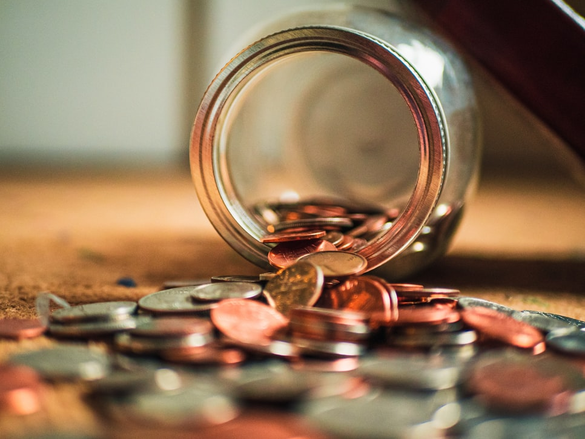

# THIS is how to store money and currency using Swift
## This can go wrong!

<br/>
<sub>Photo by Josh Appel on Unsplash<sub>

Difficulty: Beginner | Easy | **Normal** | Challenging<br/>
This article has been developed using Xcode 12.5, and Swift 5.4

This will cover how we might store "money," and make sure everything works as well as you might expect.

## Prerequisites: 
* You will be expected to be aware how to make a [Single View Application](https://medium.com/swlh/your-first-ios-application-using-xcode-9983cf6efb71) in Swift, or be able to code in [Swift Playgrounds](https://medium.com/@stevenpcurtis.sc/coding-in-swift-playgrounds-1a5563efa089).

## Terminology:
Denary: The name of the base 10 numbering system
Double: A double-precision, floating-point value type

# "Just" use a double
Just is quite a disempowering word, especially when (in terms of currency) it can be a complete mistake.

What do I mean by this? Take a look at this example of adding two numbers:

```swift
let result: Double = 0.1 + 0.2
print (result)
```
This, of course, results in the answer being `0.30000000000000004`.
What?

# Take a step back
You should do all you can to avoid this. Internally the machine you are using makes use of [floating point numbers](https://stevenpcurtis.medium.com/what-is-a-floating-point-number-6991f2f85a28), and cannot represent digits such as 0.1 properly. This means that (depending on the machine you are using) the number is actually rounded to some value close to 0.1, introducing some imprecision.

The representation is internally stored as an Exponent and Mantissa in something like the following image

[Mantissa.png](Mantissa.png)

In fact I've previously written an article on [just this subject](https://medium.com/@stevenpcurtis.sc/what-is-a-floating-point-number-6991f2f85a28) that explains the mantissa and exponent.

In any case, by adding these numbers we **double** that imprecision as we are attempting to store numbers in a binary representation! 
Bad times.

# "Just" use Decimal
That adjective around using a Decimal. In any case, this does actually lead us to the right answer when we add two numbers.
```swift
let tenPence: Decimal = 0.1
let twentyPence: Decimal = 0.2
let correctResult = tenPence + twentyPence
print (tenPence + twentyPence) // 0.3
```

Since a `Decimal` is a `struct` that represents a base-10 number - that is a decimal represents the number in `Denary` under the hood in Swift.

Joy! But wait, 0.3 isn't correct. I want this to be *correctly* formatted, that is to have a currency sign. If not we might get confused between Hong Kong Dollars and Kenyan Shillings, which doesn't sound right to me. 
 
# Format it
If we're going to format this, let us use a `NumberFormatter`:

```swift
extension NumberFormatter {
    static var currencyFormatter: NumberFormatter {
        let formatter = NumberFormatter()
        formatter.numberStyle = .currency
        formatter.locale = Locale(identifier: "en_GB")
        return formatter
    }
}
```

Which can then be used with the following line:

```swift
print("GB", NumberFormatter.currencyFormatter.string(from: correctResult as NSDecimalNumber)!)             // GB £0.30
```

Now isn't that nice!

Note that the locale has been set as `en_GB` here so all of the formatted numbers would appear as `£`, that is Pound Sterling.

# Decimal, NSDecimalNumber or NSDecimal
`Decimal` is a struct, and is the Swift name for `NSDecimal` (which comes from the Objective-C days much like most Structs prefixed with `NS`. In face `Decimal` is just the new name for `NSDecimal`. 

Equally, `NSDecimalNumber` is equivalent to `NSNumber` - but of course further reading is available in the [documentation](https://developer.apple.com/documentation/foundation/nsdecimalnumber) should you so choose to go and have a look.

# Conclusion
When you deal with numbers, you are dealing with imprecision. When you are dealing with currency you need to understand that this imprecision is not acceptable - now imagine that you have a financial App and it sometimes gets your balance wrong - even by a cent or one pence this isn't appropriate. 

So don't let it happen.

I hope this article has helped you out a little bit, and you can understand that problem and a possible solution for it.

Thanks for reading!

 If you've any questions, comments or suggestions please hit me up on [Twitter](https://twitter.com/stevenpcurtis) 
