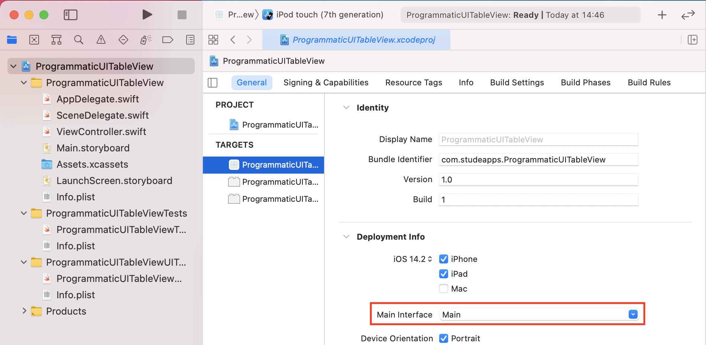
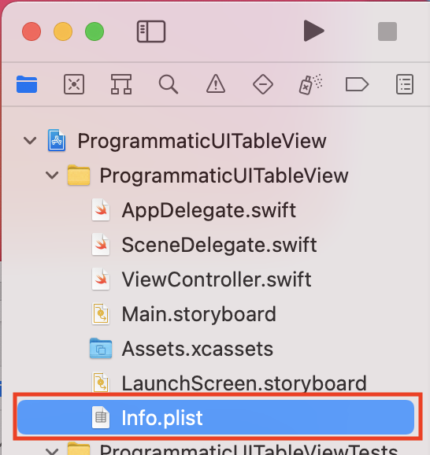
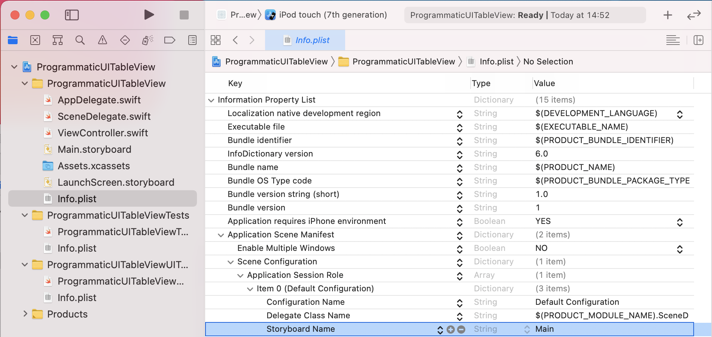

# The Programmatic UITableView Example
## Implementing the UITableView without a Storyboard


<sub>Image of the completed project</sub>

This is a project that will help us to create a list of names as an iOS application, without the use of Storyboards.
This article has been developed using Xcode 12.2, and Swift 5.3

# Create a New Project
Use Xcode's menu to create a new project, making sure to choose Swift as the language and using UIKit.
[detailed guide](https://medium.com/@stevenpcurtis.sc/avoid-storyboards-in-your-apps-8e726df43d2e)

# Removing the Storyboard
Select *Main.storyboard* and delete it from the project inspector
Remove *Main* from the Main Interface part of the general tab (this can be selected by selecting the project name at the top-left of the Project Inspector) and then select and delete *Main* there.

Select *Info*.plist in the project inspector

then expand *Application Scene Manifest*, *Item 0 (Default Configuration)*, and then delete *Storyboard Name* you can just select, and then delete it through the keyboard button.
 
# The SceneDelegate Code
In order to load the view controller we need some code! Replace the first function

`optional func scene(_ scene: UIScene, willConnectTo session: UISceneSession, options connectionOptions: UIScene.ConnectionOptions)`

with the following:

```swift
    func scene(_ scene: UIScene, willConnectTo session: UISceneSession, options connectionOptions: UIScene.ConnectionOptions) {
        guard let windowScene = (scene as? UIWindowScene) else { return }

        window = UIWindow(frame: windowScene.coordinateSpace.bounds)
        window?.windowScene = windowScene
        
        self.window = UIWindow(windowScene: windowScene)

        let vc = ViewController()
        let rootNC = UINavigationController(rootViewController: vc)

        self.window?.rootViewController = rootNC
        self.window?.makeKeyAndVisible()
    }
```

# Add the Code
Replace the code in **ViewController.swift** with the following:
```swift
import UIKit

class ViewController: UIViewController {
    
    // A property to reference a UITableView instance
    var tableView: UITableView!
    // The data, an Array of String. Each Intended to be displayed in a single TableViewCell
    let people = ["Arjun", "Tisha", "Zaara","Bob", "Kasia", "Natalia", "Colin", "Noah", "Liya", "Sergey"]

    // Called after ViewController is loaded into memory
    override func viewDidLoad() {
        // Super should always be called, as viewDidLoad() is overridden
        super.viewDidLoad()
        setupTableView()
    }
    
    // A String to identify a cell, and enable cells that scroll outside of the view to be reused
     let cellReuseIdentifier = "cell"
    
    // Creates the views that the view controller manages
    override func loadView() {
        tableView = UITableView(frame: .zero)
        self.view = tableView
    }
    
    func setupTableView(){
        // register the class of the UITableViewCell, and the identifier for reuse
        tableView.register(UITableViewCell.self, forCellReuseIdentifier: cellReuseIdentifier)
        // the delegate will be this class
        tableView.delegate = self
        // the data source will be this class
        tableView.dataSource = self
    }
}

extension ViewController: UITableViewDataSource, UITableViewDelegate {
    func tableView(_ tableView: UITableView, numberOfRowsInSection section: Int) -> Int {
        // returns the number of items in the data array, works without the return keyword
        // where there is a single line
        people.count
    }
    
    // which cell should be used for which row? Return it!
    func tableView(_ tableView: UITableView, cellForRowAt indexPath: IndexPath) -> UITableViewCell {
        // if there is an existing cell, reuse it. If not create a new cell
        if let cell = tableView.dequeueReusableCell(withIdentifier: cellReuseIdentifier) {
            // which row are we working on?
            let currentRow = indexPath.row
            // set the text from the data array
            cell.textLabel?.text = people[currentRow]
            return cell
        }
        // if no cell can be reused or created, something is seriously wrong so crash
        // the device (this should therefore not happen)
        fatalError("could not dequeueReusableCell")
    }
}
```

# Run the Project
You can use the keyboard shortcut `⌘ + R` to run the project in the simulator, and see the `UITableView` instance displayed on the screen.

# Conclusion
A UITableView is an essential part of UIKit, and this guide should help you see how the project might work. Feel free to change the `UITableView` data - that is the `String` instances stored in the `people` array to whatever you like!

Many people choose not to use a storyboard in their project, and that is fine (they often do this to have projects that are easy for many developers to work on at the same time

The [Repo](https://github.com/stevencurtis/SwiftCoding/tree/master/QuickGuide/ProgrammaticUITableView) makes things rather easier to follow in this project, and I do recommend you download the project to make things that bit easier for you.

If you've any questions, comments or suggestions please hit me up on [Twitter](https://twitter.com/stevenpcurtis) 