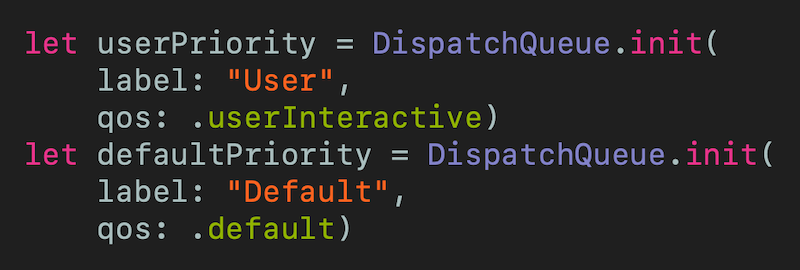
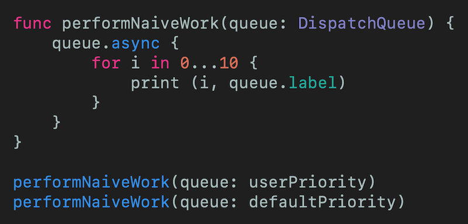
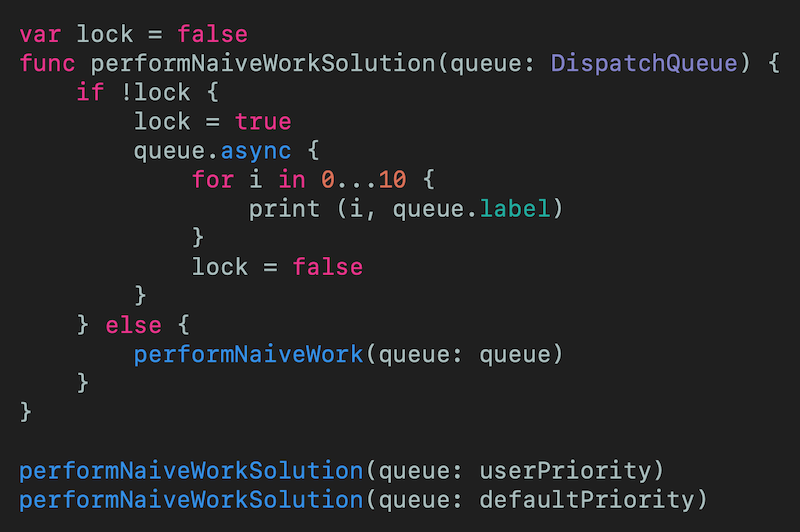
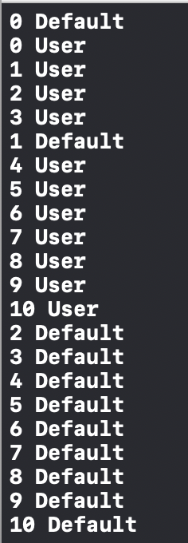
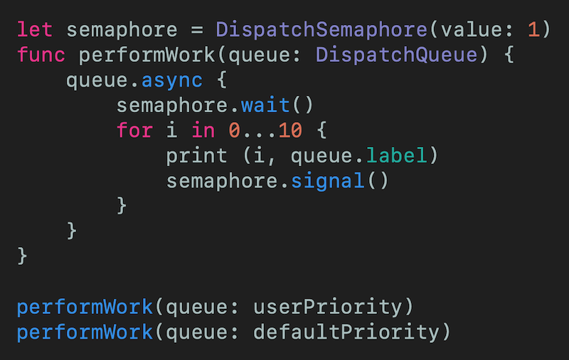

# Avoid Deadlock with Semaphores
## Stop-Wait-Go

 
Photo by Drew Hays on Unsplash

You might well be familar with [GCD](https://medium.com/swift-coding/concurrency-and-grand-central-dispatch-in-swift-gcd-f0ae063973c2), but what if you wish to make sure that you never enter a deadlocked state?

Read on!

Difficulty: Beginner | Easy | **Normal** | Challenging 
This article has been developed using Xcode 11.4.1, and Swift 5.2.2

# The importance
The [Readers-Writers Problem](https://medium.com/@stevenpcurtis.sc/the-readers-writers-problem-995a2a89d0ab
) is an important one in Computer Science.

In your iOS application you may have several threads that wish to access a shared resource (the cannonical example for this is a file).

You would not want to be in a situation where the file can be written on at the same time as it is being read - imagine that *during* the reading process the file is written. This would mean that we couldn't be certain of what we were reading; perhaps half of the original file and half of the updated file - what a disaster!

# The practical example
For each of these examples two `queues` are going to be used as follows:

 
[Click for Gist](https://gist.github.com/stevencurtis/0947427ef08e9a8b7ed4740d7ce391b6)

now if you wish to follow along in [Playgrounds](https://medium.com/@stevenpcurtis.sc/coding-in-swift-playgrounds-1a5563efa089) you'll need to `import PlaygroundSupport` and add the indefiniteExecution line `PlaygroundPage.current.needsIndefiniteExecution = true`.

with that said, we can then create a naive function that attempts to write to the console from both queues (which usually use a single thread each, but this is not guarenteed):

 
[Click for Gist](https://gist.github.com/stevencurtis/36e46d268afcdaf3b15c40d9d08c81bd)

now depending on your machine, what is going on in the world and other indecipherable variables you "might" get all of the `userInteractive` work items complete before the `default` priority items.

 
A sample output

*But this isn't guarenteed*. This isn't a good state to be in - and what if we *must* have `User` finished before `Default`?

# The naive solution

To control access (in this case printing to the console) be could block access using a Boolean. No problem!

 
[Click for Gist](https://gist.github.com/stevencurtis/f6d3aedcb24174c0f78b3371fbd80c09)

But there is a problem

 
The problem!

We aren't guaranteed that we are using the same thread when we access the function. Poor stuff!

This will *never* pass code review my friend!

# The solution: A semaphore
A `semaphore` limits the amount of concurrent work that can be completed at the same time. 

# The theoretical semaphore
A `semaphore` simply keeps a count (positive) and contains two operations which must be thread-safe as it empties a queue of threads awaiting the resource in question.
* wait: If the value is >0, decrement else block
* signal: If threads are waiting then unblock one, else increment the value

When we set up a semaphore we pass a an initial value to the Semaphone - in this example we will use 1. 

 
[Click for Gist](performwork)

So `semaphore.wait` enables waiting for the resource to become avaliable, and then releases with `semaphore.signal()`

 

That's more like it!

# Conclusion

If you've any questions, comments or suggestions please hit me up on [Twitter](https://twitter.com/stevenpcurtis) 

Why not sign up to my [newsletter](https://subscribe.to/swiftcodingblog/)
