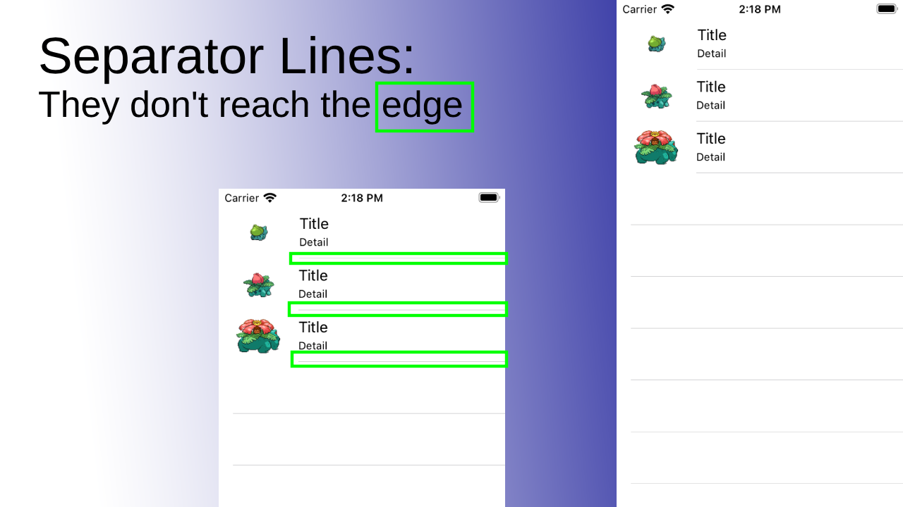

# Fix Those Annoying Separator Lines in Swift
## You can do it!



Difficulty: Beginner | **Easy** | Normal | Challenging<br/>
This article has been developed using Xcode 12.4, and Swift 5.3.2

## Prerequisites: 
* You will be expected to be aware how to make a [Single View Application](https://medium.com/swlh/your-first-ios-application-using-xcode-9983cf6efb71) in Swift.

# The setup
## Async download images
It is important to download images asynchronously. This can be placed in an extension, as follows:

```swift
extension UIImageView {
    func downloadImage(with string: String, contentMode: UIView.ContentMode) {
        guard let url = NSURL(string: string) else {return}
        URLSession.shared.dataTask(with: url as URL, completionHandler: {
            (data, response, error) -> Void in
            DispatchQueue.main.async {
                self.contentMode =  contentMode
                if let data = data { self.image = UIImage(data: data) }
            }
        }).resume()
    }
}
```

## The UIViewController

```swift
class ViewController: UIViewController {
    enum Constants {
        static let reuseIdentifier = "cell"
    }
    
    lazy var tableView = UITableView()
    
    let urls: [String] = [
        "https://raw.githubusercontent.com/PokeAPI/sprites/master/sprites/pokemon/back/5.png",
        "https://raw.githubusercontent.com/PokeAPI/sprites/master/sprites/pokemon/back/2.png",
        "https://raw.githubusercontent.com/PokeAPI/sprites/master/sprites/pokemon/back/3.png"
    ]
    
    let names: [String] = [
        "charmeleon",
        "ivysaur",
        "venusaur"
    ]

    override func viewDidLoad() {
        super.viewDidLoad()
        setupHierarchy()
        setupViews()
        setupConstraints()
    }
    
    private func setupHierarchy() {
        self.view.addSubview(tableView)
        tableView.translatesAutoresizingMaskIntoConstraints = false
        tableView.dataSource = self
    }
    
    private func setupViews() {
        tableView.register(UITableViewCell.self, forCellReuseIdentifier: "cell")
    }
    
    private func setupConstraints() {
        NSLayoutConstraint.activate([
            tableView.topAnchor.constraint(equalTo: view.topAnchor),
            tableView.bottomAnchor.constraint(equalTo: view.bottomAnchor),
            tableView.leadingAnchor.constraint(equalTo: view.leadingAnchor),
            tableView.trailingAnchor.constraint(equalTo: view.trailingAnchor)
        ])
    }
    
    override func loadView() {
        let view = UIView()
        view.backgroundColor = .red
        self.view = view
    }
}

extension ViewController: UITableViewDataSource {
    func tableView(_ tableView: UITableView, numberOfRowsInSection section: Int) -> Int {
        urls.count
    }
    
    func tableView(_ tableView: UITableView, cellForRowAt indexPath: IndexPath) -> UITableViewCell {
        
        var cell = tableView.dequeueReusableCell(withIdentifier: Constants.reuseIdentifier, for: indexPath)
        if cell.detailTextLabel == nil {
            cell = UITableViewCell(style: .subtitle, reuseIdentifier: Constants.reuseIdentifier)
        }
        cell.accessoryType = .disclosureIndicator
        cell.textLabel?.text = names[indexPath.row]
        cell.detailTextLabel?.text = "Click for Detail"
        cell.imageView?.downloadImage(with: urls[indexPath.row], contentMode: .scaleAspectFit)
        
        return cell
    }
}
```

# That looks great!
## But what about...The images do not appear

<br>

These images do not appear! This is because `cell.imageView` is optional, and the asynchronous nature of downloading an image to the ImageView does not hold a reference to the ImageView for sufficient time until the image is downloaded. The solution? Use a placeholder image:

```swift
cell.imageView?.image = UIImage(named: "placeholder")
```

where I've used a placeholder image in the asset catalogue. 

## But what about...The separator lines

<br>

the separator lines do not fill the whole screen. However, this is an easy fix!

```swift
tableView.separatorInset = .zero
```


# Conclusion
This is important stuff! You would want to lazily load images in a great deal of situations for creating Apps that are production ready. Before letting your users loose on your application you would like a great user experience. That is, you would really need to use lazy loading for your images. 


If you've any questions, comments or suggestions please hit me up on [Twitter](https://twitter.com/stevenpcurtis) 

