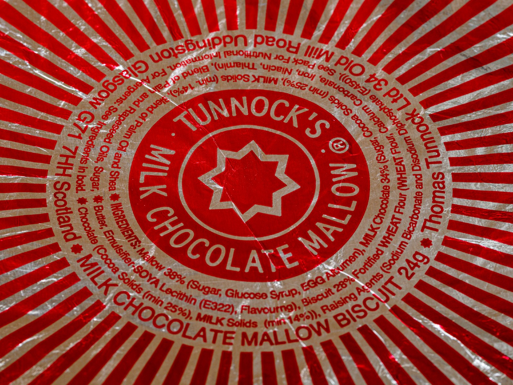

# SwiftUI Property Wrappers
## Can you see the fact it is observing?

 
Photo by Brett Jordan on Unsplash

Property Wrappers are at the heart of SwiftUI. Want to get your noses wet with this great technology?

Read on to find out all the details!

Difficulty: Beginner | **Easy** | Normal | Challenging 
This article has been developed using Xcode 11.4.1, and Swift 5.2.2

## Prerequisites: 
* You will be expected to make a [Single View SwiftUI Application](https://medium.com/@stevenpcurtis.sc/hello-world-swiftui-92bcf48a62d3) in Swift.

## Terminology
Property Wrappers: A property wrapper adds a layer of separation between code that manages how a property is stored and the code that defines a property

# The motivation
Property Wrappers are used in Swift [Example](https://medium.com/@stevenpcurtis.sc/understanding-swifts-property-wrappers-805340a8ced6), but even that article doesn't cover the specific property wrappers used in SwiftUI (although the background reading there would really help the reader of this article, especially since it covers projectedValue which are indicated with a proceeding dollar sign `$`). 

# The property wrappers
**@Published**
This is at the heart of SwiftUI, and `@Published` is a property wrapper in SwiftUI which allows objects to announce when changes occur. 

This occurs as `@Published` published changes through the projected value (preceeded with a dollar sign) which is a Publisher (invoking `objectWillChange.send()` on the enclosing `ObservableObject`).

Due to the use of will, this means that subscribers receive the new value before it is set on the property.

It should be noted that `@Published` is class contrained so should only be used with properties of classes rather than the properties of structs - and this makes sense because `@Published` can be used by many subscribers so a [reference type](https://medium.com/swlh/value-and-reference-types-in-swift-3abf240edba) really does make more sense than a [value type](https://medium.com/swlh/value-and-reference-types-in-swift-3abf240edba). 

Tells SwiftUI that it should refresh any views that use this property when it is changed.

**@State**
The wrappedValue is anything (usually a value type).
Stores the wrappedValue in the heap, and when it changes invalidates the View.
Projected value (i.e. `$`): a Binding (to that value in the heap).

It makes sense that as `@State` should be used for simple properties that belong to a single view, they would usually be marked as `private` using [Swift's Access Control](https://medium.com/swift-coding/access-control-in-swift-71228704654a)

**@StateObject**
Used to store new instance of reference type data that conforms to `ObservableObject`.
SwiftUI’s @StateObject property wrapper is designed to fill a very specific gap in state management: when you need to create a reference type inside one of your views and make sure it stays alive for use in that view and others you share it with.

**@ObservedObject**
The wrappedValue is anything that implements the ObservableObject protocol (ViewModels)
Invalidates the View when wrappedValue does objectWillChange.send()
Projected value (i.e. $): a binding (to the vars of the wrappedValue (a ViewModel)).

These properties might belong to multiple views, and as you might have guessed `@ObservedObject` is suitable for objects ([reference types](https://medium.com/swlh/value-and-reference-types-in-swift-3abf240edba))

**@Binding**
The wappedValue is a value that is bound to something else.
It gets/sets the value of the wrappedValue from some other source.
When the bound-to value changes, it invalidates the View.
Projected value (i.e. $): a Binding (self; i.e. the Binding itself)

Bindings are about having a single source of truth, that is we bind rather than making a copy.
That means when a binding is changed locally the remote (bound) data is changed too.

You would generally use an `@Binding` to pass a binding that originated from some source of truth like an `@State`

**@EnvironmentObject**
Effectively the same as `@ObservedObject`, but passed to a View in a different way.

Environment objects are visible to all Views in your body (except modally presented ones).
So it is sometimes used when a number of Views are going to share the same ViewModel.
When presenting modally, you will still want to use `@EnvironmentObject` but will need to pass this to the view.

The wrappedValue is `ObservableObject` obtained via `.environmentObject()` sent to the View
It invalidates the View when wrappedValue does `objectWillChange.send()`
Projected value (i.e. $): a Binding (to the vars of the wrappedValue (a ViewModel))

An `@EnvironmentObject` is ideal for properties that are seen as shared data, which really makes sense given the idea that the internal environment for the App should be available to interested views.

If an `@EnvironmentObject` is expected and is not supplied, a rather nasty crash will occur - meaning that their use risks runtime crashes in your code!

**@Environment**
Property Wrappers can have more variables than wrappedValue and projectedValue - they are just structs
You can pass values to set these other vars using () when you use the Property Wrapper
e.g. `@Environment(\.colorScheme) var colorScheme`
In Environment’s case, the value that you’re passing (e.g. `\.colorScheme`) is a key path.
It specifies which instance variable to look at in an EnvironmentValues struct.
There are many EnvironmentValues - ColorScheme is .dark or .light, for example! This is of type ColorScheme - passes through this type.

**@AppStorage**
Reads and writes values from `UserDefaults`, so if a value in `UserDefaults` changes and behaves much like an `@State` and invalidates the `View` when the value in question is changed.

**@FetchRequest**
This relates to a Core Data fetch request for a specific entity. 

**@GestureState**
Stores the values associated with a gesture that is currently in progress

**@Namespace**
An animation namespace to match with geometry effects

**@NSApplicationDelegateAdaptor**
Create and register a class as the App Delegate for a macOS app

**@ScaledMetric**
Reads the user's Dynamic Type setting and scales accordingly to a value provided

**@ScaledStorage**
Save and restore data for state restoration

**@UIApplicationDelegateAdaptor**
Used to create and register a class as the App Delegate

**@FocusedBinding**
Binds values in the key window, like a selected text field.

**@FocussedValue**
Similar to `@FocussedBinding`, but  does not unwrap the bound value.

# Conclusion
The approach taken above has been to list the property wrappers that you might use in your SwiftUI application. Now using them....potentially a different case.

Something to think about...

If you've any questions, comments or suggestions please hit me up on [Twitter](https://twitter.com/stevenpcurtis) 
