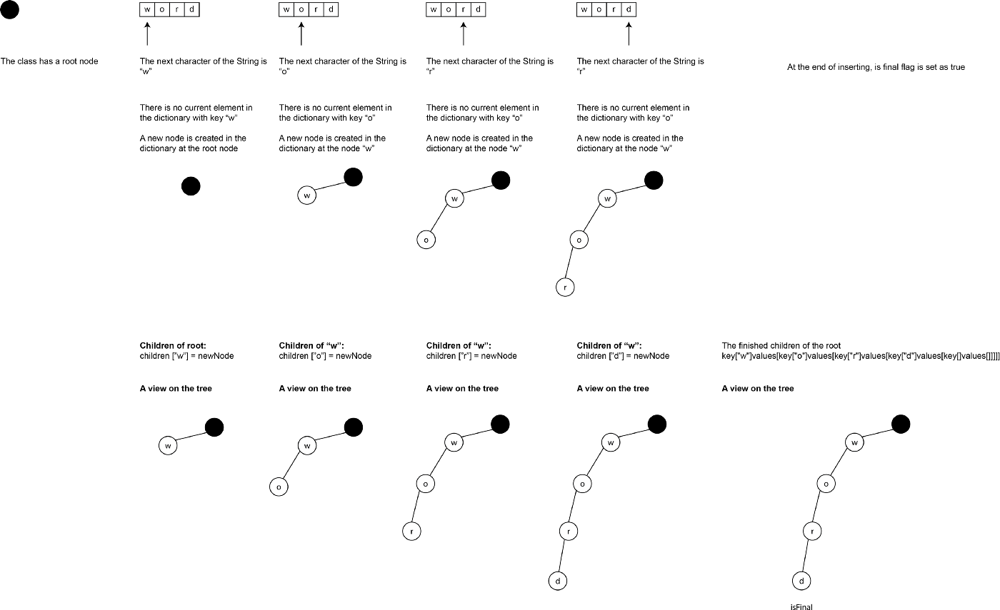

# Theory 

## Invert Binary Tree (node is a class)

```swift
func invertTree(_ root: TreeNode?) -> TreeNode? {
    if root == nil {return nil}
    let temp = root?.left
    root?.left = invertTree(root?.right)
    root?.right = invertTree(temp)
    return root
    }
```

## Heap
[https://gist.github.com/stevencurtis/cb7cd4ad164cdb36302ac08c4289210b](https://gist.github.com/stevencurtis/cb7cd4ad164cdb36302ac08c4289210b)
[https://medium.com/p/4bf1091dcdd9/edit](https://medium.com/p/4bf1091dcdd9/edit)

## Trie
[https://medium.com/swift-coding/tries-in-swift-4afb9b82785f](https://medium.com/swift-coding/tries-in-swift-4afb9b82785f)<br>
<br>

[https://gist.github.com/stevencurtis/99cb5b4e3db8f3faea7f8b7f4f1b97dc](https://gist.github.com/stevencurtis/99cb5b4e3db8f3faea7f8b7f4f1b97dc)


## Data Structures

## Stack

```swift
class Stack<T> {
    private var elements = [T]()
    func pop () -> T? {
//        return elements.popLast()
        if let last = elements.last {
            elements = elements.dropLast()
            return last
        }
        return nil
    }
    
    func push(_ element: T) {
        elements.append(element)
    }
    
    func peek() -> T? {
        return elements.last
    }
}
```

## Queue
```swift
class Queue<T>: CustomStringConvertible {
    var description: String {
        get {
            return elements.description
        }
    }
    
    private var elements: [T] = []
    
    func add(_ element: T) {
        elements.append(element)
    }
    
    func peek() -> T? {
        return elements.first
    }
    
    func remove() {
        elements.removeLast()
    }
}
```

## Linked List
```swift
class Node {
    var data: Int
    var next: Node?
    
    init(data: Int, next: Node?) {
        self.data = data
        self.next = next
    }
}

class LinkedList {
    var head: Node
    init(head: Node) {
        self.head = head
    }

}

let tail = Node(data: 2, next: nil)
let head = Node(data: 1, next: tail)
let list = LinkedList(head: head)
```

To iterate need an iterator - [full article](https://medium.com/@stevenpcurtis.sc/iterate-through-a-linked-list-in-swift-c1bc7ef14e07)

## Binary Tree

**Breadth - first search**[Article](https://medium.com/better-programming/swift-using-bfs-for-leetcode-problems-82696faf58d8)


## Binary Search

[Binary Search](https://medium.com/swift-coding/binary-search-in-swift-f38957f23ae)
