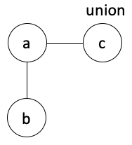
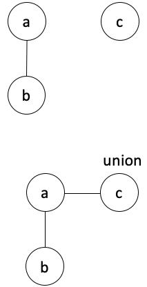
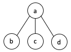

# The Union-Find Data Structure in Swift
## That is, disjoint sets

<br>
<sub>Image by Giorgio Trovato</sub>

# Before we start
Difficulty: Beginner | Easy | **Normal** | Challenging<br>
This article has been developed using Xcode 12.1, and Swift 5.3

## Prerequisites
* You will be expected to be aware how to either make a [Single View Application in Swift](https://medium.com/swlh/your-first-ios-application-using-xcode-9983cf6efb71) or use a [Playground](https://medium.com/@stevenpcurtis.sc/coding-in-swift-playgrounds-1a5563efa089)
* It would be useful to have some knowledge of [Sets in Swift](https://medium.com/swlh/sets-in-swift-94cea4dd7c9f)
* A [dictionary](https://medium.com/@stevenpcurtis.sc/dictionary-in-swift-52b14d6cfa93) is used to store the nodes

## Keywords and Terminology
Data Structure: A way of formatting data
Disjoint: (of two or more sets) having no elements in common
Union-find data structure: A data structure that sorts a collection of disjoint sets

# The Union-Find Data
## The background
Disjoint-set data structures play a key role in an efficient version of [Kruskal's algorithm](https://medium.com/@stevenpcurtis.sc/kruskals-algorithm-in-swift-717ec98a7245?sk=662a888b2b3293ad3af12a0ad83d120a) for finding the minimal spanning tree of a graph, and the data structure form the basis of a wide variety of algorithms including cycle detection. 

More than that, they are have applications in Data Science and are even commonly used for LeetCode questions. 

Depending on your needs, they can be a big deal.

## Disjoint sets
<br>
If we have two sets that **do not share elements** we have a situation like that shown in the diagram above.

In Swift this might be represented as the following sets, p and q.

```swift
let p: Set<String> = ["a", "b", "c", "d", "e", "f"]
let q: Set<String> = ["y", "z"]
```

That is, the sets p and q are disjoint because they have no members in common. The example works with any type of set you would like to implement in Swift.

## Transitive Property of Equality
Equality is transitive. This means:

```swift
if a = b and b = c, then a = c
```

## Approach to relevant problems
We can perform a [BFS](https://medium.com/better-programming/swift-using-bfs-for-leetcode-problems-82696faf58d8) from any two nodes - if one node can be reached from the other they are by definition in the same set.

By adopting this approach, a BFS would have to be performed for each query (that is, each pair you wish to test whether they are in the same set) leaving the time complexity as O(N * M) where N is the set size and M is total number of queries to be tested.

An alternative is to use the `Union-Find Data Structure` where elements in the same set are kept in a single group. It is this approach that this article will focus on.

## My Node Class
This node must be a `class` type as the node references itself. The class also confoms to [the Hashable protocol](https://medium.com/better-programming/swifts-hashable-fd57e6cd6426)

```swift
class Node<T: Hashable>: Hashable {
    static func == (lhs: Node<T>, rhs: Node<T>) -> Bool {
        lhs.hashValue == rhs.hashValue
    }
    
    func hash(into hasher: inout Hasher) {
      hasher.combine(value)
    }
    
    var value: T
    var parent: Node?
    var children = [Node]()
    init(_ val: T) {
        self.value = val
    }
    
    func addChild(_ node: Node) {
        children.append(node)
        node.parent = self
    }
}
```

## The Union-Find Data Structure
**Main operations**
There are three basic operations that are used in such a data structure:
* find: Determine which subset an element is within
* union: Join two subsets into a single set 
* addSet: Create a new set with an element

Therefore to create a tree (which effectively the set is) we will need to combine `addSet` and `union` since every time we wish to add a new element we must first call `addSet` to add it, before using `union` to join it into an existing set.

This means we might have the set {"a", "b"} and then add a set {"c"}.<br>


We then can call union on two elements for example<br>


So each subset is represented by a tree.

**The UnionFind class**
Here we conform to [the Hashable protocol](https://medium.com/better-programming/swifts-hashable-fd57e6cd6426) and [the Comparable protocol](https://medium.com/@stevenpcurtis.sc/swifts-equatable-and-comparable-protocols-54811114a5cf), and store an index of nodes and a set number for each one.

As a result the class is defined as follows:

```swift
class UnionFind<T: Hashable & Comparable> {
    var index: [Node<T>: Int] = [:]
    var size: Int = 0
}
```

with, of course, the following functions are declared below:

*addSet*
Here we create a new tree for each element, and the index is taken from the number of nodes:


```swift
func addSet(_ element: T) {
    index[Node(element)] = index.count // Node will have neither parent or children
    size += 1
}
```

*find*
We can check the index dictionary 
```swift
func find(_ element: T) -> Int? {
    let node = Node(element)
    if let setIndex = index[node] {
        return setIndex
    }
    return nil
}
```

*union*
We take the root for the tree from the firstElement, and the root from the secondElement. Then we put the secondNode onto the firstNode, for example: <br> 

```swift
func union(_ firstElement: T, _ secondElement: T) {
    let firstNode = Node(firstElement)
    let secondNode = Node(secondElement)
    if let firstIndex = index[firstNode], let secondIndex = index[secondNode] {
        if firstIndex != secondIndex {
            secondNode.parent = firstNode
            secondNode.children = firstNode.children
            firstNode.children = [secondNode]
            index[secondNode] = index[firstNode]
        }
    }
}
```

**sameSet (additional)**
If the index for the firstElement is the same as the index for the secondElement, they are in the same set.
```swift
func sameSet(_ firstElement: T, _ secondElement: T) -> Bool {
    let firstNode = Node(firstElement)
    let secondNode = Node(secondElement)
    if let firstIndex = index[firstNode], let secondIndex = index[secondNode] {
        if firstIndex == secondIndex {return true}
    }
    return false
}
```

**Improvements**
These improvements come under the banner of heuristics, and enable performance improvesment

*Union by Rank*
When performing a `union`, if one tree has a shorter depth then ithe algorithm should favour keeping the tree as short as possible. This can be accomplished by moving the longer tree to the shorter one. This can reduce the time to find the root of any particular tree.

*Path Compression*
All nodes on a tree should have a single parent, which is the root.<br>
<br>
Something approaching this has been implemented in my version of the Union-find structure described above, and is shown in the [Repo](https://github.com/stevencurtis/SwiftCoding/tree/master/ss).

# Conclusion
The [Repo](https://github.com/stevencurtis/SwiftCoding/tree/master/Theory/UnionFind) has all of the code so you can see how this all works in a working Swift Playground.

If you've any questions, comments or suggestions please hit me up on [Twitter](https://twitter.com/stevenpcurtis) 
