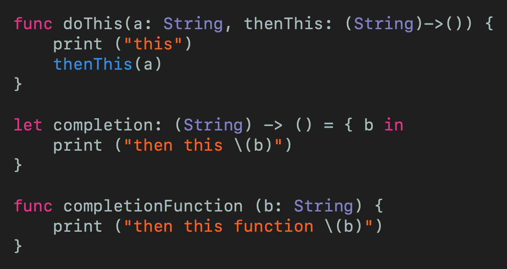
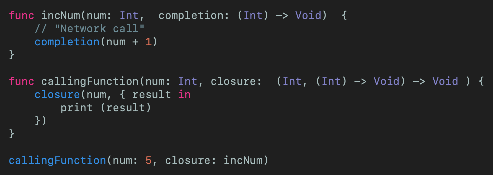
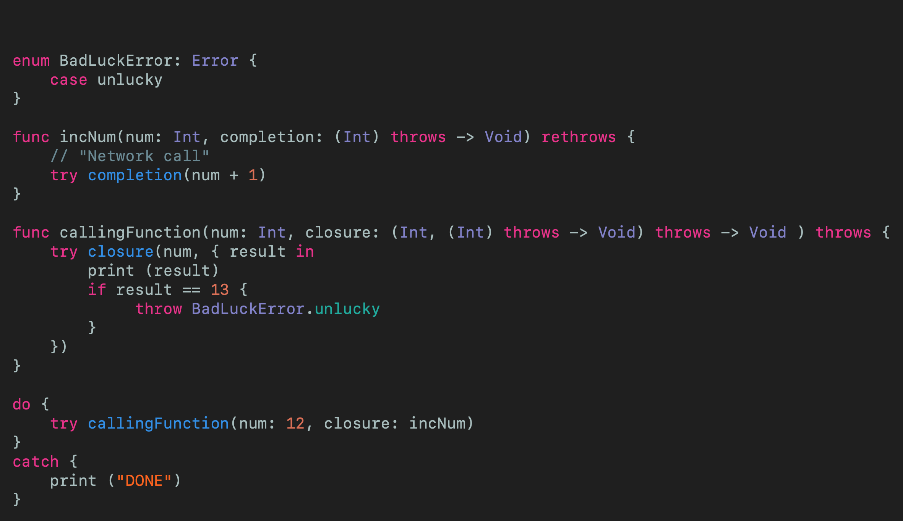

# Throw Inside a Closure
## Closures CAN throw!

 
Photo by MIKHAIL VASILYEV on Unsplash

Difficulty: Beginner | **Easy** | Normal | Challenging 
This article has been developed using Xcode 11.4.1, and Swift 5.2.2

## Prerequisites: 
* You will be expected to be aware how to make a [Single View Application](https://medium.com/swlh/your-first-ios-application-using-xcode-9983cf6efb71) in Swift
* You will need to have some knowledge of [closures](https://medium.com/swift-coding/swift-closures-c14cb7aa2170), although I'll do my best to have you covered in this article
* By definition this article relies on some knowledge of [error handling](https://medium.com/better-programming/error-handing-in-swift-dda6e3fb1c65) in Swift
* You should be aware of [@escaping](https://medium.com/@stevenpcurtis.sc/what-is-the-difference-between-escaping-and-nonescaping-closures-in-swift-3ba6a8276105)

## Terminology
Closures: A combination of functions and references to the surrounding context

# Motivation
One of the important things in swift is using [*closures*](https://medium.com/swift-coding/swift-closures-c14cb7aa2170) to make functions return and good practice for Swift coders.

## The ordinary use of closures
One of the uses of `closures` is to 

 
[Click for Gist](https://gist.github.com/stevencurtis/ba8ef46546d7847e9f9285589e8f2461)

the output of this (when called with `doThis(a: "test", thenThis: completion)`)  is (can you guess?)

`this
then this test`

now because the function that is passed can be changed, we can do just that by instead passing throught the `completionFunction` by using `doThis(a: "test", thenThis: completionFunction)` which then gives the following output:

`this
then this function test`

Now notice that the first function `completion` is assigned to a constant (through `let`) but the second is simply a `function` - no matter, `Swift` can cope with both of these functions. 

Awesome - we are passing a closure to a function as a function- Most excellent news. 

We'll expand this *second example* as we move forwards in this tutorial.

 

## The use of async closures
Network calls can return at any time after they are called. I'm pretending to have a network call here, but you could actually do it with the following [network manager](https://medium.com/@stevenpcurtis.sc/my-basic-httpmanager-in-swift-db2be1e340c2) if you'd like).

So imagine that you need to need to go to the network to do some work. You make a network call to increment a number (it's an example, right?) but goes and makes a network call to do just that. Well, we can model that:

 
[Click for Gist](https://gist.github.com/stevencurtis/3f02ba5d920c83e31aad1ea282f451e3)

 

I know there are some tricky parts to this -  we are using a trailing closure which can be tricky. Assuming you're OK with all that let us move on. 

But there is a problem (in this example, and not just that it is contrived) - `incNum` will produce an error if 13 is returned.

## The Error
So what about producing an `Error` when 13 is returned from `incNum`?. 

Let us say that 13 is a bad number (in some cultures it is considered to be unlucky). So we shall set up a rather basic function `incNum` that will call a `completion` handler to return a number increased by one.

The `Error` will indicate if we have returned an 'unlucky' number from `incNum` - but see underneath the code  snippet for the (rather large) error:

 
[Click for Gist](https://gist.github.com/stevencurtis/ecfa9f58e8099a4700dae57dba954776)

`Invalid conversion from throwing function of type '(Int) throws -> Void' to non-throwing function type '(Int) -> Void'`

Oh dear!

What Swift is telling us, is that when we `throw BadLuckError.unlucky` we are actually throwing from the closure.

## Throwing from a trailing closure
The solution will come first, followed by the explaination

 
[Click for Gist](https://gist.github.com/stevencurtis/a297dc461ce139d92fb67cfb681cdc3b)

We have marked `callingFunction` as `throws` which means that it can `throw` an error by placing the `throws` keyword at the end of the function signature. This meant that we needed to call the calling function suing a `do-try-catch` block:

`do {
    try callingFunction(num: 12, closure: incNum)
}
catch {
    print ("DONE")
}`

The `incNum` function will not throw an error on it's own, so is marked with `rethrows` as it throws from the `completion` - which therefore must be marked with `try`.  Since `completion` does indeed `throw` it has it's signature changed to `(Int) throws -> Void)`.

This modified signature is copied back to the signature of the `callingFunction`  which marks the closure as the same `(Int) throws -> Void)`, but since `rethrows` can only be used in function declarations `throws` is used instead.

Fantastico!

# The caveats
You can't throw an error from async closures - which means that you either force the closure to be synchronous using semaphores (not recommended due to performance) or use Swift's [result type](https://medium.com/@stevenpcurtis.sc/result-type-in-swift-1b4e2a84f2c2).

# Conclusion
I hope this article has helped you out!

It can be tricky to work through this type of article - we are using `throws` and `rethrows` and it can feel a little complex. However, I hope this article has helped you out and you can see how to progress in your coding journey.

If you've any questions, comments or suggestions please hit me up on [Twitter](https://twitter.com/stevenpcurtis) 

Feel free to sign up to my [newsletter](https://slidetosubscribe.com/embed/swiftcoding/)
