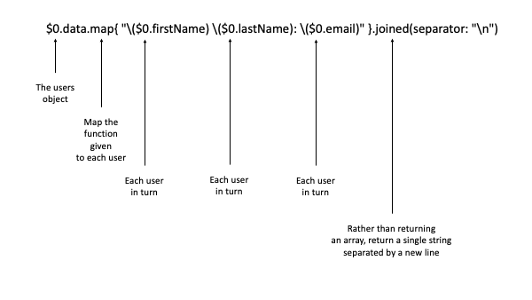

# STOP Using $0 as a Shorthand Parameter in Swift
## You need readable code!

<br/>
<sub>Photo by Sharon Mccutcheon on Unsplash<sub>

If you are using closures in your Swift code, you may become familiar with the shorthand parameter syntax that is often represented as `$0` or `$1`.

You may or may not be aware that these continue, in that for each parameter the shorthand name in incremented by one each time (`$2` and `$3` up to the number of arguments as is required)

## Why should you use shorthand parameters
Rather than having to think of parameter names, and making our code less easy to read as a result.

## Why should you use stop using shorthand parameters
Rather than making your code easier to read, you have so many shorthand parameters that you are not sure which to choose

## So rather than stopping using $0, you are saying it depends?
Exactly!

Common functions like `sort` are a commonly used, and you can expect to use shorthand parameters in those closures and readability is not detrimentally affected (and arguably is increaded) by using shorthand parameters.

A line with several functions and repeated shorthand parameters (like `$0` repeated) cannot be said to be easy to read.

We need to weigh up
 - readability through brevity
 against
 - readability through clarity

 if you are not in a position to decide between the two there is one important thing you can actually do. Sleep on your code, and come back the next day and see it with fresh eyes. Alternatively use [rubber duck debugging](https://medium.com/@stevenpcurtis.sc/rubber-duck-debugging-298349134056).

## Can we have some common examples of these shorthand arguments?
Of course you can!

Sorting is one of those common usages of shorthand arguments. Perhaps you want to sort a list (array) of names in alphabetical order?

```swift
let names = ["Tom", "Ahmed", "Karen"]
let ascendingNames = names.sorted(by: { $0 < $1 })
```
`$0` and `$1` represent names and the order that the names should be sorted in, in this case the order is ascending.

Mapping can become a little complex, so here is a code snippet that is meant to model a viewModel that might make an API call (not in the code snippet) and returns a list of loggedInUsers. This could potentially be printed in a ViewController by calling a completion handler (shown here with the line `viewModel.completion!(loggedInUsers)`).

```swift
struct Users {
    let data: [Data]
    struct Data {
        let firstName: String
        let secondName: String
        let email: String
    }
}

let loggedInUsers = Users(data: [Users.Data(firstName: "Dave", secondName: "Roberts", email: "dave@loggedin"), Users.Data(firstName: "Latasha", secondName: "Wilson", email: "latasha@loggedin")])


class ViewModel {
    var completion: ((Users) -> Void)?
    var complexCompletion: ((Users, Users) -> Void)?
}

let viewModel = ViewModel()

viewModel.completion = {
    print($0.data.map{ "\($0.firstName) \($0.secondName): \($0.email)" }.joined(separator: "\n"))
}

viewModel.completion!(loggedInUsers)
```

this gives the following output:

```swift
Dave Roberts: dave@loggedin
Latasha Wilson: latasha@loggedin
```

When you begin to look at this closure you can see the issue. `$0` Represents more than one thing in one line. Now whether you think that is acceptable or not depends on you, and what is acceptable for your team.
<br/>
That is: It depends!
# Conclusion
Another "it depends" answer? Well, unfortunately this is coding. In the case of thinking through solutions there are no absolute rights or wrongs.

You're going to have to make your own decisions. Sorry.

Oh, there is an accompanying video [HERE](https://youtu.be/n4UnKpQEdv8). Thanks.

If you've any questions, comments or suggestions please hit me up on [Twitter](https://twitter.com/stevenpcurtis)
