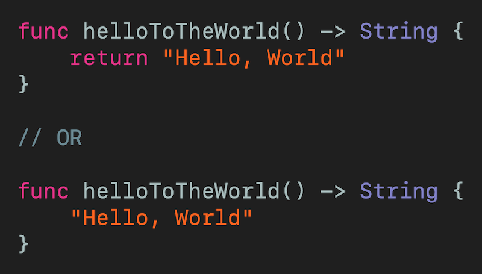

# How Implicit Return Types Removed that Annoying Swift Inconsistency
## Deal with that Error

 
Photo by Ryan Stone on Unsplash

For a long time we haven't been living in a fair environment. It's true: With a [closure](https://medium.com/swift-coding/swift-closures-c14cb7aa2170) you can omit the return keyword, but you could never do the same in a function. THAT GOT FIXED!!

Difficulty: Beginner | **Easy** | Normal | Challenging 
This article has been developed using Xcode 11.4.1, and Swift 5.2.2

# The example
Most Swift ninjas (those with 6 months+ of experience, that is) know writing short and elegant code is extremely important, and helps us write easily understandable code that is  a pleasure to maintain. 

Closures have helped us do this for some time, I mean look at the following examples (which are all equivalent!, presuming we have `let arr = [1,2,3,4,5]`):

 
[Click for Gist](https://gist.github.com/stevencurtis/b5c56b713bfb0a7d7d94fd28f5afc1cf)

We FINALLY have parity for functions, and the following can be called through `helloToTheWorld()` - isn't that awesome?!?
 
[Click for Gist](https://gist.github.com/stevencurtis/274a809f3846aa9f2cd4af5da44f9f49)

**REMEMBER THOUGH**
It only works with one liners. Whack a `print` statement into the above to get it to be two lines and you'll have to add `return`.

Still it's awesome!

# Why it matters
When we talk about consistency in your code, it makes sense that we have that same consistency in programming languages. By bringing functions into line with closures Swift has done just that - and for this reason we should rejoice and thank the Swift team, or something.

# Conclusion
What a tip. At least you won't have a heart attack when you see that there is no return in a function. So that's something!

If you've any questions, comments or suggestions please hit me up on [Twitter](https://twitter.com/stevenpcurtis) 

Why not sign up to my [newsletter](https://subscribe.to/swiftcodingblog/)
