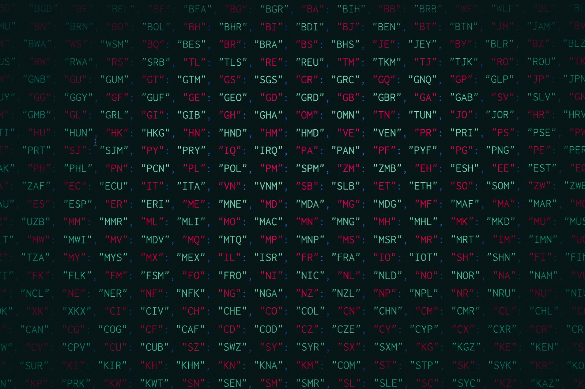

# Parse JSON Without Knowing the Type: iOS Swift
## Shell commands

<br/>
<sub>Photo by Pankaj Patel on Unsplash<sub>

Difficulty: Beginner | **Easy** | Normal | Challenging<br/>
This article has been developed using Xcode 11.6, and Swift 5.2.4

You'd usually be well advised to use [Postman](https://medium.com/@stevenpcurtis.sc/api-testing-using-postman-b5ea3eeb85cb) to understand what type of data you are going to download from an EndPoint, or even better use your API documentation (or have a chat with your neighbourhood friendly backend developer). 

But what if there is a problem, and you want a quick and dirty solution to seeing the response from the EndPoint right in the App.

That is the problem that this article seeks to solve.

# Prerequisites:
* You will be expected to be aware how to make a [Single View Application](https://medium.com/swlh/your-first-ios-application-using-xcode-9983cf6efb71) in Swift
* All of the network management is going on under the hood but is essentially my basic [network manager](https://medium.com/@stevenpcurtis.sc/my-basic-httpmanager-in-swift-db2be1e340c2)

# Terminology
JSON: JavaScript Object Notation, a lightweight format for storing and transporting data

# The code
The main code for this is rather short.  You can perform the following when you have received data from an endpoint, and then while writing your code (you wouldn't do this in production, right? You'd know the model...even...you'd...)

```swift
do {
    let jsonObject = try JSONSerialization.jsonObject(with: data, options: JSONSerialization.ReadingOptions.mutableContainers)
    if let jsonDict = jsonObject as? NSDictionary {
        print (jsonDict)
    }
    if let jsonArray = jsonObject as? NSArray {
        print (jsonArray)
    }
} catch {
    // error handling
}
````

# The code in situ
The project is in the [repo](https://github.com/stevencurtis/SwiftCoding/tree/master/Tips/ParseJsonNoType) which of course features one of those rather large issues - calling a network service from a `UIViewController` and I'd usually recommend anyone use [MVVM-C](https://medium.com/@stevenpcurtis.sc/mvvm-c-architecture-with-dependency-injection-testing-3b7197eb2e4d) or similar, this is just an example and gives access to full testing for the network manager etc.

So a larger example (here in the `viewDidLoad()` method) and calls `https://jsonplaceholder.typicode.com/todos/8` which is an endpoint that can be called using the following code:

```swift
let networkManager = NetworkManager(session: URLSession.shared)
let url = URL(string: "https://jsonplaceholder.typicode.com/todos/8")!
networkManager.fetch(url: url, method: .get, headers: [:], token: nil, data: nil, completionBlock: { result in
    switch result {
    case .success(let data):
        do {
            let jsonObject = try JSONSerialization.jsonObject(with: data, options: JSONSerialization.ReadingOptions.mutableContainers)
            if let jsonDict = jsonObject as? NSDictionary {
                print (jsonDict)
            }
            if let jsonArray = jsonObject as? NSArray {
                print (jsonArray)
            }
        } catch {
            // error handling
        }
    case .failure(let error):
        print (error)
    }
})
```

# Conclusion
Knowing the type of data that you will receive from an endpoint is really important. You might feel that you'd always need [Postman](https://medium.com/@stevenpcurtis.sc/api-testing-using-postman-b5ea3eeb85cb) to solve this type of problem. However, there are instances where you are downloading JSON and it seems to work in Postman but not in your iOS implementation - what might be going wrong? 

This article has hopefully given you a solution to this problem.

If you've any questions, comments or suggestions please hit me up on [Twitter](https://twitter.com/stevenpcurtis) 

Why not sign up to my [newsletter](https://subscribe.to/swiftcodingblog/)
