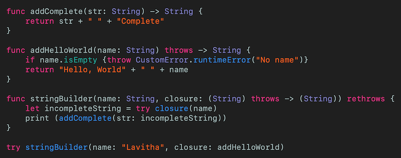
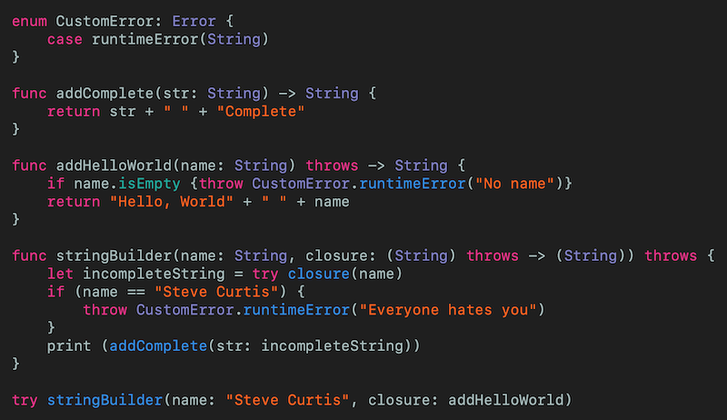
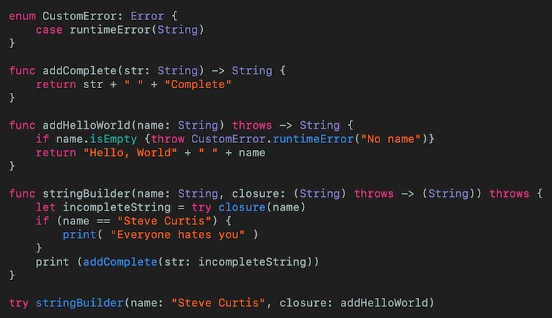
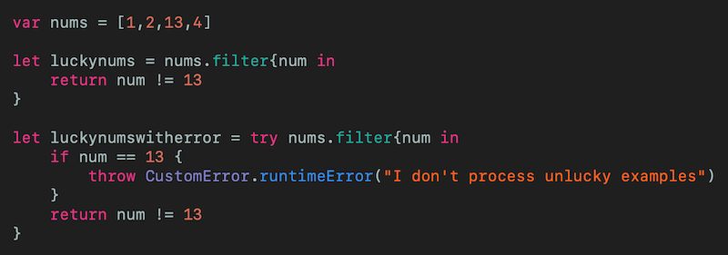

# Throw or Rethrow that Error?
## Deal with that Error

 
Photo by Mohamed Nohassi on Unsplash

[Error handling](https://medium.com/better-programming/error-handing-in-swift-dda6e3fb1c65) in Swift has come a long way. But wait, there are `throws` and `rethrows` keywords? What's going on?

An in-depth look into the two types of [closures](https://medium.com/swift-coding/swift-closures-c14cb7aa2170), focussing on @escaping and @nonescaping closures.

Difficulty: Beginner | Easy | **Normal** | Challenging 
This article has been developed using Xcode 11.4.1, and Swift 5.2.2

# The example
Imagine a function that adds stuff to `Strings` (This is a convoluted example, people!).

We are going to use the following `CustomError` to make things clear

 
[Click for Gist](https://gist.github.com/stevencurtis/70bd3687e4315b4dfd4f72452a2b0514)

The requirements are that we have a function that takes a name and function that takes a `String` and returns a `String`.  This function that we take, however, can throw an error. This leads to our outer function being able to return an error itself.

Already the language of outer function starts to get a little confusing. In steps the code snippet!

 
[Click for Gist](https://gist.github.com/stevencurtis/c19fd59b997008cb1549ecf21afdd9d2)

of interest is the `addHelloWorld` function - this can throw so the `throws` keyword is placed before the `->` symbol, and within the function we do indeed throw a `CustomError`. 

This is reflected in the `func stringBuilder(name: String, closure: (String) throws -> (String)) rethrows` function signature - first because the `closure` parameter as `(String) throws -> (String)` allows the contained function to `throw`. However, there is another part of this - the final keyword `rethrows` is because the function in the parameter `throws` - `stringBuilder` does not throw an error itself.

## Let us get confused

You know the statements above? They are all correct! This means that we are all set.

But what if `stringBuilder` can throw an error? 

It sounds simple - we can replace the `rethrows` keyword with `throws`.

Now we know that everyone hates "Steve Curtis" (just look at [Twitter](https://twitter.com/stevenpcurtis) to see what a loser looks like ) , and we can get `stringBuilder` to check this and throw an error if the name given  is some sort of idiot.

Let us look at the code
 
[Click for Gist](https://gist.github.com/stevencurtis/790844e9a1dc67417bfc76465ee8af54)

which all seems fine - it is like the function `stringBuilder` both `throws` and `rethrows` at the same time! 

But what if we remove the concrete example of  `stringBuilder` throwing the error. The code would look something like the following:

 
[Click for Gist](https://gist.github.com/stevencurtis/86b13b7d508d7210a327f44cfc8d0fb5)

Now **thing here is** the function is still marked as `throws` rather than `rethrows`. This means that the function can be marked as `throws` even though it, well, doesn't actually throw.

Confused? I hope not...

# Caveats
Apple have this covered off in their [documentation](https://docs.swift.org/swift-book/ReferenceManual/Declarations.html)

"A throwing method can’t override a rethrowing method, and a throwing method can’t satisfy a protocol requirement for a rethrowing method. That said, a rethrowing method can override a throwing method, and a rethrowing method can satisfy a protocol requirement for a throwing method.".

# Why it matters
It's not just your code. At all. Apple use `rethrows` in their higher-order functions like [filter](https://developer.apple.com/documentation/swift/sequence/3018365-filter) where the function signature is

`func filter(_ isIncluded: (Self.Element) throws -> Bool) rethrows -> [Self.Element]
`
Now why would that be important?

 
[Click for Gist](https://gist.github.com/stevencurtis/a97ec68c763cd9ab262207eb72c11f34)

You can see that the closure for `filter` can either return a throwing function, or not, and in the second case needs to be marked with `try` to help.

# Conclusion
Throwing, rethrowing it can all be a little difficult to get a grip on.

Try an you shall suceed!

HAHAHAHA

and so on.

You get the point.

If you've any questions, comments or suggestions please hit me up on [Twitter](https://twitter.com/stevenpcurtis) 

Why not sign up to my [newsletter](https://subscribe.to/swiftcodingblog/)
