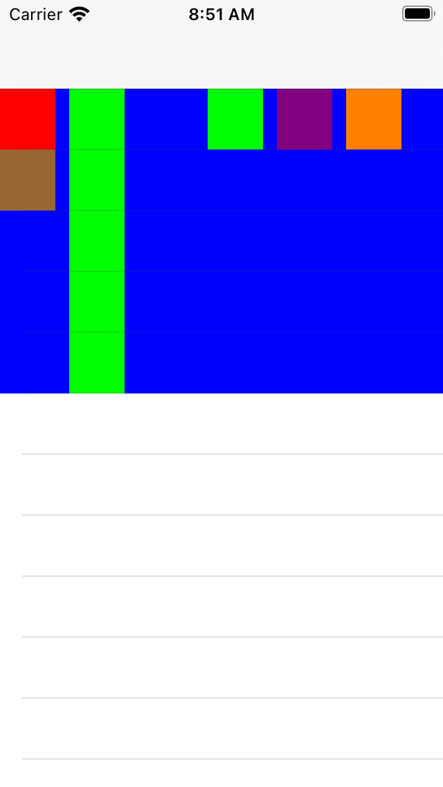

# Embed a UICollectionView Inside a UITableView
## That is, so it works


<sub>Image by Gary Bending @kris_ricepees</sub>

# Before we start
Difficulty: Beginner | Easy | **Normal** | Challenging<br>
This article has been developed using Xcode 12.1, and Swift 5.3

## Prerequisites
* You will be expected to be aware how to either make a [Single View Application in Swift](https://medium.com/swlh/your-first-ios-application-using-xcode-9983cf6efb71) or use a [Playground](https://medium.com/@stevenpcurtis.sc/coding-in-swift-playgrounds-1a5563efa089)
* This article uses the Storyboard to implement the `UITableView`, and then creates the `UITableViewCell` programmatically.

## Keywords and Terminology
IndexPath: The path to a specific node in a tree of nested array collections
UICollectionView: An object that manages an ordered collection of data items and presents them using customizable layouts
UICollectionViewCell: The on-screen cell for the UICollectionView type
UITableView: A view that presents data using rows arranged in a single column
UITableViewCell: The visual representation of a single row in a table view

# This project
## Background
Creating great user interfaces should interest us all. `UIKit` has some great advantages as a mature framework that developers are used to.

## What this project is, and what it isn't
As an example this project will display a `UITableView`, and the `UITableViewCell` instances will each contain a `UICollectionView` that shold a `UICollectionViewCell` that only displays a colour that has been predefined in the `UIViewController` instance.

This project doesn't use an interesting architecture (I'd recommend [MVVM-C](https://medium.com/@stevenpcurtis.sc/mvvm-c-architecture-with-dependency-injection-testing-3b7197eb2e4d) and instead holds all of the data within the main `UIViewController` instance. Therefore it is not ready for projection, and is more suited to a demonstration application that accompanies this article as a fully [downloadable repo](https://github.com/stevencurtis/SwiftCoding/tree/master/UICollectionViewInUITableViewCell/).

## The look of the project
I've set up a rather bare-bones end project which has a `UITableView`, with 5 rows each with a `UICollectionView` (these have a blue background). Within this we have between 2 and 10 `UICollectionViewCell` instances that are of various colors.



When you click the `UICollectionViewCell` instances they simply print the `indexPath` to the screen.

# The implementation
## The gotcha - let a UITableViewCell consume gestures
I always forget!

When you subclass a `UITableViewCell` and want it to be able to consume gestures, you should set the property `isUsableInteractionEnabled` to be true like this:
```swift
contentView.isUserInteractionEnabled = false
```

which can be written in the [initializer](https://medium.com/@stevenpcurtis.sc/swift-initializers-fc12908a9106) for the subclass (the full subclass is detailled in the article).

## The UIViewController
The main `UIViewController` instance is linked through an [outlet](https://medium.com/@stevenpcurtis.sc/connect-storyboard-objects-to-code-4105f9b99bba), and uses an [extension](https://medium.com/@stevenpcurtis.sc/extensions-in-swift-68cfb635688e) to store the `UITableViewDelegate` and `UITableViewDataSource` to keep things looking tidy.

The data is stored in a property that represents and Array of Arrays:
```swift
    var data = [[UIColor.red, UIColor.green, UIColor.blue, UIColor.green, UIColor.purple, UIColor.orange, UIColor.blue, UIColor.green, UIColor.blue, UIColor.green], [UIColor.brown, UIColor.green], [UIColor.blue, UIColor.green], [UIColor.blue, UIColor.green], [UIColor.blue, UIColor.green]]
``` 

Note: I do apologise that I've called this ViewController, and that is not idea.

```swift
class ViewController: UIViewController {

    @IBOutlet weak var tableView: UITableView!

    var data = [[UIColor.red, UIColor.green, UIColor.blue, UIColor.green, UIColor.purple, UIColor.orange, UIColor.blue, UIColor.green, UIColor.blue, UIColor.green], [UIColor.brown, UIColor.green], [UIColor.blue, UIColor.green], [UIColor.blue, UIColor.green], [UIColor.blue, UIColor.green]]
    
    func setUpTableView() {
        tableView.delegate = self
        tableView.dataSource = self
        tableView.register(MyTableViewCell.self, forCellReuseIdentifier: "tablecell")
    }
    
    override func viewDidLoad() {
        super.viewDidLoad()
        setUpTableView()
    }
}

extension ViewController: UITableViewDelegate {}

extension ViewController: UITableViewDataSource {
    func tableView(_ tableView: UITableView, numberOfRowsInSection section: Int) -> Int {
        data.count
    }
    
    func tableView(_ tableView: UITableView, cellForRowAt indexPath: IndexPath) -> UITableViewCell {
        if let cell = tableView.dequeueReusableCell(withIdentifier: "tablecell", for: indexPath) as? MyTableViewCell {
            cell.selectionStyle = .none
            cell.updateCellWith(row: data[indexPath.row])
            return cell
        }
        fatalError("Unable to dequeReusableCell")
    }
}
```

So the most important part of this is that the `tableView...cellForRowAt` that calls a function on the `UITableViewCell`

```swift
cell.updateCellWith(row: data[indexPath.row])
```

which means that we need to look at the `UITableViewCell` instance

## The UITableViewCell
Here the [initializer](https://medium.com/@stevenpcurtis.sc/swift-initializers-fc12908a9106) has been overridden, which gives the opportunity to set up the `UICollectionView`. 

The initializer has the responsibility of setting up the instance of the `UICollectionView`, and the `updateCellWith(row:)` function injects data into the collection view, and to be clear this is a row of data (which in this case is an array of `UIColor`.

The basic class looks like the following:

```swift
class MyTableViewCell: UITableViewCell {
    var dataRow: [UIColor] = []
    var collectionView: UICollectionView!

    override func awakeFromNib() {
        super.awakeFromNib()
    }
    
    func updateCellWith(row: [UIColor]) {
        self.dataRow = row
        self.collectionView.reloadData()
    }

    override init(style: UITableViewCell.CellStyle, reuseIdentifier: String?) {
        super.init(style: style, reuseIdentifier: reuseIdentifier)

        let layout = UICollectionViewFlowLayout()
        layout.estimatedItemSize = CGSize(width: 40, height: 44)
        layout.scrollDirection = .horizontal
                
        self.collectionView = UICollectionView(
            frame: self.frame,
            collectionViewLayout: layout)
        self.collectionView.isScrollEnabled = true
        collectionView.delegate = self
        collectionView.dataSource = self
        self.collectionView.register(UICollectionViewCell.self, forCellWithReuseIdentifier: "cell")
        self.addSubview(self.collectionView)
        self.collectionView.backgroundColor = .blue
        contentView.isUserInteractionEnabled = false
       }
       
       required init?(coder: NSCoder) {
       		fatalError("init(coder:) has not been implemented")
       }
}
```

the extra section of code to make this work is an extension. This is the extension that creates the `UICollectionViewCell` instances and sets up the data (which in this case is a `UIColor` from the data property in `MyTableViewCell`.  

```swift

extension MyTableViewCell: UICollectionViewDelegate {}
extension MyTableViewCell: UICollectionViewDataSource {
    func collectionView(_ collectionView: UICollectionView, numberOfItemsInSection section: Int) -> Int {
        dataRow.count
    }
    
    func collectionView(_ collectionView: UICollectionView, cellForItemAt indexPath: IndexPath) -> UICollectionViewCell {
        let cell = collectionView.dequeueReusableCell(withReuseIdentifier: "cell", for: indexPath)
        cell.backgroundColor = dataRow[indexPath.item]
        return cell
    }
    
    func collectionView(_ collectionView: UICollectionView, didSelectItemAt indexPath: IndexPath) {
        print (indexPath)
    }
}
```

Of course it is more than possible to use a `UICollectionViewCell` subclass and dequeue that from the collectionview, but unfortunately this is not quite within the scope of this project. We can, however, see the rather friendly print function that is within the `collectionView...didSelectItemAt` function. 

# Conclusion
The [Repo](https://github.com/stevencurtis/SwiftCoding/tree/master/UICollectionViewInUITableViewCell/) makes things rather easier to follow in this project, and I do recommend you download this project.

The fact is we are playing with code here, and trying to make sure that the Single Responsibility principle [from the SOLID principles noted by Robert Cecil Martin](https://stevenpcurtis.medium.com/the-solid-principle-applied-to-swift-974e29b94d23) and avoiding putting everything into one monster class, even when we have a `UICollectionView` embedded in a `UITableViewCell`

I hope this article has helped you, and of course has moved you forwards in your coding journey.

If you've any questions, comments or suggestions please hit me up on [Twitter](https://twitter.com/stevenpcurtis) 
