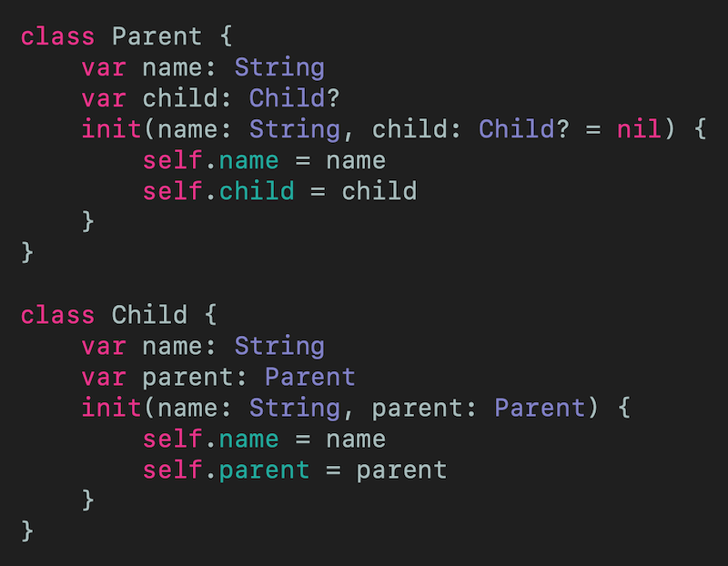
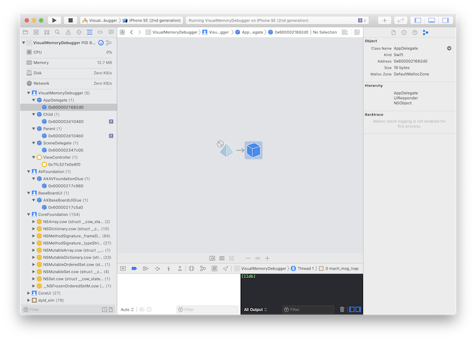
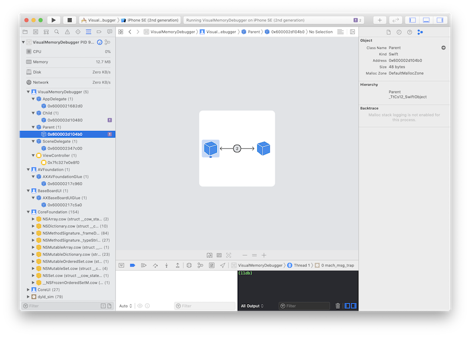
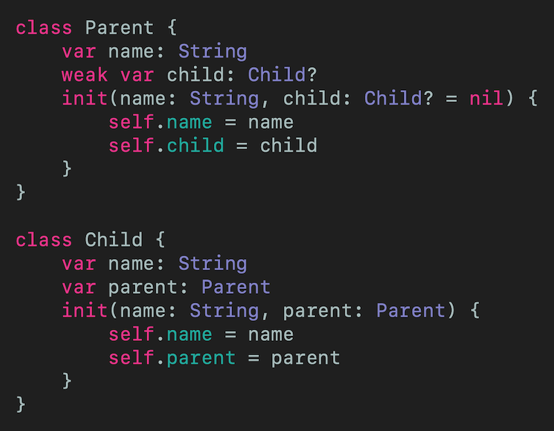
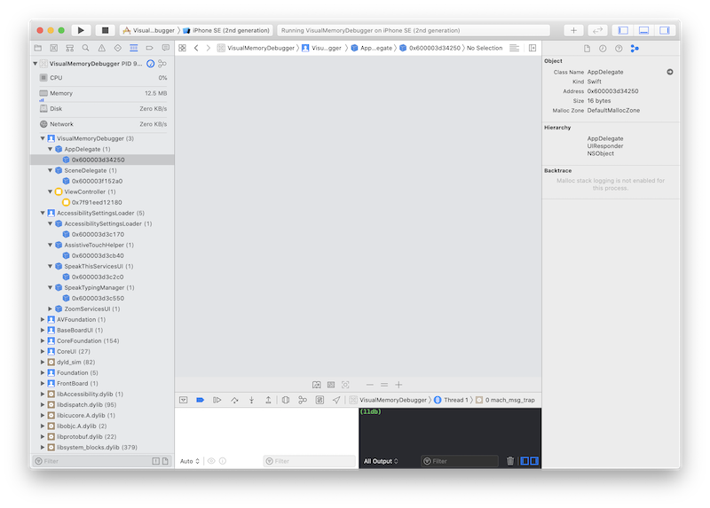

# SEE Retain Cycles in Xcode
## Xcode has a Visual Memory Debugger!

 
Photo by Yoann Boyer on Unsplash

It can be difficult tracking down retain cycles in Xcode. This is the article (with example) to help you to use this great feature!

Difficulty: **Beginner** | Easy | Normal | Challenging 
This article has been developed using Xcode 11.5, and Swift 5.2.4

## Prerequisites: 
* You need to either be able to make a [Single View Application](https://medium.com/swlh/your-first-ios-application-using-xcode-9983cf6efb71) in Swift
* This projection uses [Optionals](https://medium.com/@stevenpcurtis.sc/simply-optionals-in-swift-or-not-ee63c3999e16) and [Classes](https://medium.com/@stevenpcurtis.sc/classes-in-swift-5b969441ce72)

# The issue
Retain cycles can cause memory leaks. If a root object creates a group of objects that hold onto each other with strong references, and later that group is released it cannot be freed with memory. 

This is because reference counting is used, and every time a reference is deleted the count decreases by one and an object can only be released when the reference count for that object is zero.

A reference cycle means the reference count can never reach zero, and objects cannot be released and this causes a memory leak - which means that the memory used is never released back for use in the system.

# Creating an example
## Caveats
* I wouldn't usually put the definitions of two classes into a file, but it may be easier to see from the following example.
* I wouldn't usually set the child as nil, and then later set the child as a parent. It's a simple example
* Parents can have multiple children. Children can have multiple parents. This is a simple example, so it doesn't follow the business rules of life. It's a simple example

## The example

We have two classes, a `Parent` and `Child` class. Now it is optional for parent to have a single child (in this example) and a child always has a single parent. 

In Swift properties have strong references (as opposed to [weak or unowned](https://medium.com/@stevenpcurtis.sc/swift-self-weak-or-unowned-7e2327974f36)) so all of the references are strong here.

 
[Click for Gist](https://gist.github.com/stevencurtis/193409c45d77f249212e08846a588d6e) 

The retain cycle is between the parent and the child - neither of them can be released even when a `UIViewController` instance that created them no longer exists. Speaking of which, here is the `UIViewController` instance creatively named as `ViewController`:

 
[Click for Gist](https://gist.github.com/stevencurtis/f5c8830c06cb07e412f42d9b941ffdad) 

So the `UIViewController` creates a `Parent` and `Child`, which will be retained even if the `ViewController` no longer exists because the `Child` holds onto the `Parent` (and vice-versa) with strong references. 

This is all downloadable from the [repo](https://github.com/stevencurtis/VisualMemoryDebugger) so you can see it in practice.

## Viewing the retain cycle
When we run the project, nothing bad happens. Great!

However, that job interview you've got will reject you for your retain cycle. 

Let us use Xcode's memory debugger to actually **see** the memory cycle.

So having run the project, at right the bottom of the Xcode window we see the following toolbar:

 

let us take this one step at a time: the memory debugger icon is highlighted with a red rectangle in the following image:

 

that is, click the following image:

 

Xcode will take a second to build the memory graph, and you should see the problem. You'll see a purple ! on the left-hand side of the screen. 

 

Clicking on the two purple exclamation marks give us a couple of images showing the retain cycle. We can also see the information that the classes of `Child` and `Parent` are the problem. Well, in this case we know that but in future, we should use this feature and thank Xcode for this!

 

of course the parent looks much the same.

 

## Fixing the retain cycle
Everything is strong in this cycle! We can fix that by making the `Parent`->`Child` relationship weak.

 
[Click for Gist](https://gist.github.com/stevencurtis/ca1691f15ea3f3862705cc2bae675725) 

Going back to the memory graph we can see there isn't a retain cycle any longer

 

Joy!

# Conclusion
Xcode has great tools in instruments, and some prefer to use those. However, the visual memory debugger is a great tool to allow us to see these pesky issues that you might have in your code.

This is another great tool to have at our disposal!

If you've any questions, comments or suggestions please hit me up on [Twitter](https://twitter.com/stevenpcurtis) 

Why not sign up to my [newsletter](https://subscribe.to/swiftcodingblog/)
