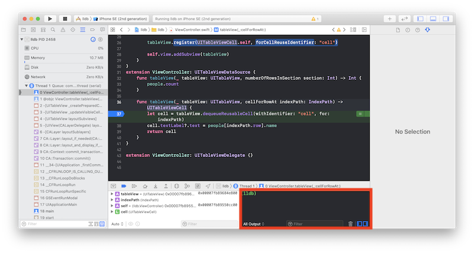
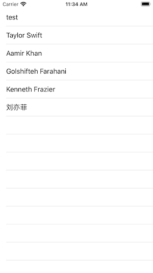
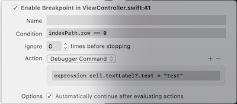
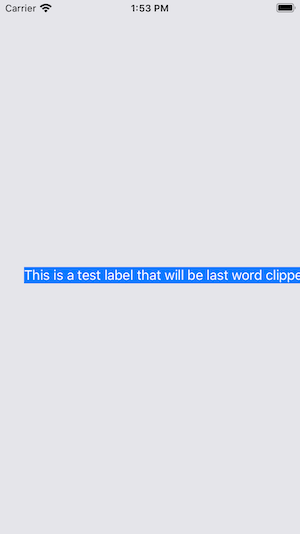
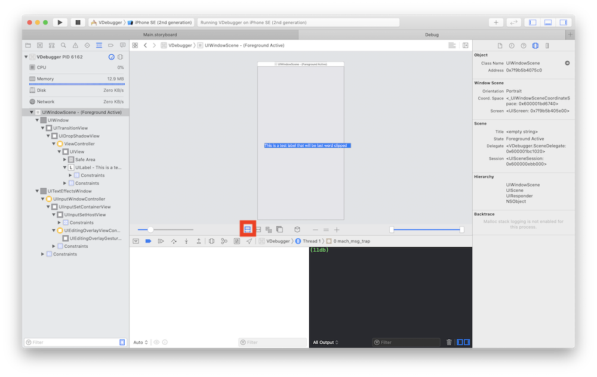
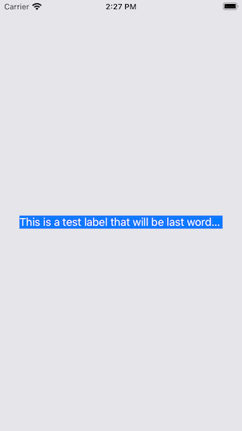

# Use lldb to Dynamically Change Code in Xcode
## More than po

<br/>
<sub>Photo by Billy Chester on Unsplash<sub>

Isn't Xcode rather great? You can use breakpoints to help you see the current state of your application at a given time.

Many programmers know and understand the `po` command - but here we are going to take a deeper dive (sic) into the debugger and what we are able to do - even changing variables on the fly! Read on…

# Prerequisites:
You will be expected to be aware how to make a [Single View Application](https://medium.com/swlh/your-first-ios-application-using-xcode-9983cf6efb71) in Swift

# The repo
There is a rather basic application stored in the [repo](https://github.com/stevencurtis/SwiftCoding/tree/master/lldb) that can allow you to display the names of some people in a `UITableView`. There aren't any tricks in there, it really is a simple-me-do implementation.BUT for the tests to work you must make sure that `Peeps.json` is visible to the test target (i.e. is a member of the test target).

# Basic po
`po` = Print object description

In my rather simple project I've decided to set a [breakpoint](https://medium.com/@stevenpcurtis.sc/debug-using-breakpoints-in-xcode-705cc9ce6d4c) on the`let cell = ...` line

```swift
func tableView(_ tableView: UITableView, cellForRowAt indexPath: IndexPath) -> UITableViewCell {
    let cell = tableView.dequeueReusableCell(withIdentifier: "cell", for: indexPath)
    cell.textLabel?.text = people[indexPath.row].name
    return cell
}
```

that gives us a project that provides us a blank screen on the simulator, but also gives us access to `lldb` in the debug area (highlighted in red below):

<br/>

Typing `po indexPath` here provides us with a textual representation  of indexPath - in this case the first indexPath

```
▿ 2 elements
- 0 : 0
- 1 : 0
```

Now the tableView will be populated from the people array, which is an array of `struct`. 

Typing `po people[indexPath.row]` gives us a textual representation of the `PeopleModel` that would 

```
▿ PeopleModel
- name : "Donald J Trump"
▿ job : 1 element
  ▿ 0 : Job
    - role : "President"
    - industry : "Politics"
```

of an instance of the `PeopleModel` type. 

We can make this a **little** easier to read by conforming to the `CustomDebugStringConvertable` protocol in our `PeopleModel` `struct`.

```
extension PeopleModel: CustomDebugStringConvertible {
    var debugDescription: String {return name}
}
```

Now instead of seeing the name of the type at the top of the output, we see the name of the person (in this case "Donald J Trump" at the top.)

```
▿ Donald J Trump
- name : "Donald J Trump"
▿ job : 1 element
  ▿ 0 : Job
    - role : "President"
    - industry : "Politics"
```
But `po` (print object description) can do more than just that. We can perform computations on the `People` Array - perhaps view the last element in the array through `po people.last`,  the first person's name `po people.first?.name` or a host of other Swift functions. 

# expression
`po` itself is an alias for expression, which when passed `--object-description` functions in exactly the same way as `po`.

Print out the complete people array: `expression --object-description -- people`

# create your own command alias

This can be done with `command alias` followed by your new alias, completed by the expression.

However, these do not persist over mutliple sessions. 

# Basic p
'p' = Print

You might get some unexpected results if you use `po` on things that aren't objects (for example `NSNumber` instances) 

Once again (with the breakpoint in the same place, Typing `p people[indexPath.row]` gives us a textual representation of the `PeopleModel`, but with different formatting. 

```
(lldb.PeopleModel) $R2 = {
  name = "Donald J Trump"
  job = 1 value {
    [0] = (role = "President", industry = "Politics")
  }
}
```

This can later be referred to as `$R2` in lldb (so `p $R2` will give the same result as above, and `p $R2.name` )

You may also see the non-human readable format by using `expression --raw` that is, `expression --raw -- people[indexPath.row]`. This raw print gives a nightmare printout as follows:

```
(lldb.PeopleModel) $R2 = {
  name = {
    _guts = {
      _object = {
        _countAndFlagsBits = {
          _value = -4611686018427387890
        }
        _object = 0x4000600001fd2e00
      }
    }
  }
  job = {
    _buffer = {
      _storage = {
        rawValue = 0x0000600000ad4440 {
          Swift.__ContiguousArrayStorageBase = {
            Swift.__SwiftNativeNSArrayWithContiguousStorage = {
              Swift.__SwiftNativeNSArray = {}
            }
            countAndCapacity = {
              _storage = {
                count = {
                  _value = 1
                }
                _capacityAndFlags = {
                  _value = 2
                }
              }
            }
          }
        }
      }
    }
  }
}
```

The human readable formatter works for many types when using `p` - unless you are using `raw` this makes things much easier to understand and to read (that being the point in human readable output, you know!)

# Basic v
The value of a variable is read from memory, and is output using the same formatter as `p`. 

v does not compile code - so is very fast! However computed values cannot be calculated.

`v indexPath`

Gives a view of the two indicies

In this implementation v `self.people` will not resolve, as people is a lazy var (feel free to play with the implementation to see how else you can frame this, and what else you can do).

# The differences
Dynamic type resolution means that `v` can be very useful in some individual cases when using `lldb`.
<br/>

# Dynamically chaging the data in the UITableView
This is it! 

As we have seen above, we can use `expression` in lldb.

Now if we put a breakpoint on line 41 like:
<br/>

we can wait for the first time the breakpoint is hit, and type the following in lldb

`expression cell.textLabel?.text = "test"`
<br/>

`breakpoint disable` as a command gets rid of the breakpoint (you might click on the breakpoint to disable it), and then continue with  ⌃ + ⌘ + Y

<br/>

The first line of the `UITableView` is now displaying test! As expected (this is what I expected, what did you expect?)

# Dynamically automatically change the data
We can add a debugger command to the breakpoint. 

A right-click on the breakpoint gives some wonderful opportunities. Now if we choose a `Debugger Command` for the same code, that is `expression cell.textLabel?.text = "test"` and make sure it only happens for the execution where `indexPath.row == 0`

<br/>

Note that I also ticked the box to automatically continue - stopping me having to press the annoyong `⌃ + ⌘ + Y` keyboard combination

# What if you can do the same for visual elements?
Here I've created a simple view with a `UILabel` that will be clipped. You might get some feedback from a user that the label is clipped - this is unacceptable!

<br/>

Once the application is run, you can go to xCode and press the button highlighted with a red box below:

<br/>

We enter the visual debugger, and we can see that the label is clipped (well, we knew that!). Here we are trying to identify the clipped image - and there is button we can press to show views that have been clipped (highlighted in red below):

<br/>
the button next to that is constraint mode, and we can see all of the constraints in operation at this point in time.

Now you can click on any element on the left-hand side, right-click and print description. If you print descriptions of the constraints, it becomes obvious that one of the constraints of the label is wrong. In my case, this is the following:

```swift
Printing description of $16:
<NSLayoutConstraint:0x6000038ca120 UILayoutGuide:0x600002296060'UIViewSafeAreaLayoutGuide'.trailing == UILabel:0x7f9b5b4185f0'This is a test label that...'.trailing - 30   (active)>
```
 now we can find this constraint, and then cast it to `NSLayoutConstraint` in order to `po`
 
 `po ((NSLayoutConstraint *)0x6000038ca120)`
 
 which displays
 
 ```swift
 <NSLayoutConstraint:0x6000038ca120 UILayoutGuide:0x600002296060'UIViewSafeAreaLayoutGuide'.trailing == UILabel:0x7f9b5b4185f0'This is a test label that...'.trailing - 30   (active)>
 ```
 
 now I want this `trailing - 30` to become a `trailing + 30`
 
 so we can set that with
 
` expression [((NSLayoutConstraint *)0x6000038ca120) setConstant:30]`
 
 I want to update the paused application with the following expression
 
 `expression -l objc -- (void)[CATransaction flush]`

and then the simulator (or your device) shows the changes!! CAN.
<br/>


# Conclusion
Like anything in programming, using different tools is important depending on the context - you might use `p`, `po` or `v` depending on what you want to acheive and how you want to manipulate data.

I hope this short article has given you some ideas on how you can use these features of `lldb` and how you can think about using this tool to write better code!

By dynamically changing code while it is running you can change things while the code is running - cutting down on the amount of time you need to spend running and rerunning code. Saving you time? What an article!

I hope this article has been of help to you, and you can see the code from this is included in the attached [Repo](https://medium.com/r/?url=https%3A%2F%2Fgithub.com%2Fstevencurtis%2FSwiftCoding%2Ftree%2Fmaster%2FAlamofireNetworking) to get the whole lot in one go!

If you've any questions, comments or suggestions please hit me up on [Twitter](https://medium.com/r/?url=https%3A%2F%2Ftwitter.com%2Fstevenpcurtis)
